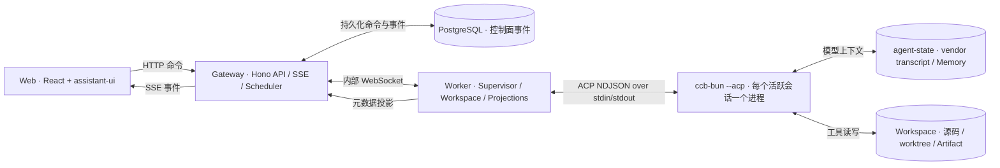

# DeepHarness

DeepHarness 是一个围绕 [`vendor/claude-code`](vendor/claude-code) 构建的私有 Web Agent Harness。它把 Claude Code 的 Agent 能力通过 [Agent Client Protocol（ACP）](docs/adr/0001-acp-only-vendor-boundary.md) 接入浏览器，并在 Harness 层提供会话控制、事件持久化、权限审批、恢复、自动化、能力审计和运行时隔离。

项目面向私有、单操作者部署。默认运行形态是 Docker Compose；浏览器只连接 Gateway，Gateway 通过内部 WebSocket 调度 Worker，Worker 再以 ACP stdio 驱动锁定版本的 `ccb-bun --acp`。

> DeepHarness 不直接 import 或修改 vendor 的 Agent 内部实现。ACP 未暴露的能力会被明确标记为能力缺口，而不会通过私有补丁伪装成已支持。

## 主要能力

- **Web 会话与流式对话**：基于 React、Vite 和 assistant-ui，支持多会话目录、实时消息、工具调用、取消、模型与权限模式切换。
- **可靠的会话生命周期**：支持新建、关闭、fork、resume/load 恢复、空闲进程回收、Worker 重连和显式 `recovery_required` 状态。
- **持久化控制面**：会话命令和规范化事件先写入 PostgreSQL，再通过 SSE 广播；支持幂等命令、事件去重和断线重放。
- **权限与交互**：将 ACP 工具权限请求和结构化问题投影到 Web，支持允许、拒绝、回答、过期和 Agent 退出清理。
- **Agent 活动视图**：跟踪 Agent、Task、Team、工具调用、输出游标和活动限制，并允许停止受支持的后台活动。
- **自动化**：提供 Goal、Workflow、Cron 和 Background Job 的持久化模型、调度器、状态机和 Web 管理界面。
- **扩展与上下文可观测性**：展示命令、Skill、Plugin、Hook、MCP、上下文用量、compact 边界、Memory 元数据和恢复兼容性。
- **Artifacts 与平台投影**：登记工作区 Artifact，提供预览和下载，并投影 LSP、Web source 与平台集成状态。
- **多 Provider 配置**：内置 Anthropic、Amazon Bedrock、Google Vertex AI、Microsoft Foundry、OpenAI-compatible、Gemini 和 Grok 配置档案及独立 smoke profile。
- **Vendor 能力治理**：结合静态源码审计、真实 ACP probe、Harness 证据、能力矩阵和 diff gate，阻止未经评审的能力回退进入发布。

## 架构



一次典型 prompt 的路径如下：

1. Web 向 Gateway 提交带幂等键的会话命令。
2. Gateway 将 command/turn 持久化到 PostgreSQL，再通过内部 WebSocket 投递给 Worker。
3. Worker 为对应 Harness 会话准备共享工作区或隔离 worktree，并启动或复用该会话自己的 `ccb-bun --acp` 子进程。
4. Worker 通过 ACP 调用 `session/prompt`，把 ACP update、权限请求、usage、工具活动等规范化为 Harness event。
5. Gateway 先保存事件并更新投影，再通过 `/api/sessions/:sessionId/events` 的 SSE 流推送给 Web。
6. Agent 的完整模型上下文仍由 vendor JSONL transcript 管理；PostgreSQL 不尝试从 UI 消息重建 vendor 上下文。

### 不可绕过的边界

- **ACP-only**：业务运行时只执行锁定构建的 `ccb-bun --acp`，stdout 专用于 ACP NDJSON，stderr 独立采集。
- **一会话一进程**：每个活跃 Harness 会话对应一个独立 Agent 进程；Worker 可以并发托管多个进程，但受最大并发和物理工作区写锁限制。
- **双事实来源**：PostgreSQL 是 Harness 控制面的事实来源，vendor transcript 是 Agent 恢复上下文的事实来源。
- **事件先落库后广播**：浏览器重连不会改变事件顺序或丢失已持久化的控制面状态。
- **不挂载 Docker Socket**：Gateway、Worker 和 Agent 都不能取得宿主机 Docker daemon 控制权。
- **Vendor 源码只读治理**：`vendor/claude-code` 以 Git submodule 锁定；升级通过 pointer、审计、diff 和回归测试完成。

对应决策记录见 [`docs/adr`](docs/adr)。

## 仓库结构

| 路径 | 职责 |
| --- | --- |
| [`apps/web`](apps/web) | React/Vite Web UI；聊天运行时、Activity、Capabilities、Extensions、Automation、Context 和 Platform/Artifacts 页面。 |
| [`apps/gateway`](apps/gateway) | Hono HTTP API、认证与 CSRF、SSE、Worker WebSocket、会话控制、调度器和 PostgreSQL 投影。 |
| [`apps/worker`](apps/worker) | ACP client、Agent 进程 supervisor、工作区/worktree、Provider、活动、Memory、Artifact、扩展和平台投影。 |
| [`apps/test-model`](apps/test-model) | 集成测试和 E2E 使用的确定性假模型服务。 |
| [`packages/protocol`](packages/protocol) | Web、Gateway、Worker 共享的命令、事件和记录类型。 |
| [`packages/database`](packages/database) | PostgreSQL 访问层和按阶段演进的 migrations。 |
| [`packages/vendor-capabilities`](packages/vendor-capabilities) | Vendor 静态 probe、ACP probe、能力分类、manifest/diff 和 CLI gate。 |
| [`vendor/claude-code`](vendor/claude-code) | 锁定的 Agent 内核 Git submodule；业务代码不得直接依赖其内部 API。 |
| [`config`](config) | Provider profiles、vendor lock、能力评审和 Harness 能力证据。 |
| [`artifacts/capabilities`](artifacts/capabilities) | 生成的能力 manifest、审计报告和版本差异。 |
| [`tests`](tests) | unit、contract、integration 和 Playwright E2E 测试。 |
| [`docs`](docs) | ADR、安装、运维、数据生命周期、能力矩阵、升级手册和阶段验证记录。 |
| [`compose.yaml`](compose.yaml) | 生产/本地基础栈；PostgreSQL、Gateway、Worker，以及按 profile 启用的测试服务。 |
| [`compose.test.yaml`](compose.test.yaml) | 隔离测试覆盖：tmpfs PostgreSQL、假模型、测试控制面和验证容器。 |
| [`compose.providers.yaml`](compose.providers.yaml) | 使用真实凭据的 Provider smoke profiles。 |
| [`compose.platforms.yaml`](compose.platforms.yaml) | LSP 与 Chromium 可选 Worker 镜像/profile。 |

## 快速开始

### 前置条件

推荐的运行方式只要求：

- Git，且能够初始化 submodule；
- Docker Desktop，或 Docker Engine + Docker Compose v2；
- 一份可用的模型 Provider 凭据；
- 一个准备挂载给 Agent 的本地代码目录。

Bun、Node.js、PostgreSQL、浏览器测试运行时和可选语言服务器均由镜像提供，不是宿主机启动基础栈的前置条件。若要直接在宿主机执行 TypeScript 命令，则使用仓库锁定的 Bun `1.3.13`。

### 1. 初始化 Vendor submodule

```bash
git submodule update --init --recursive
```

当前锁定的仓库、commit、tag 和 Bun 版本记录在 [`config/vendor-lock.json`](config/vendor-lock.json) 中。

### 2. 配置私有环境变量

```bash
cp .env.example .env
```

编辑 `.env`，至少确认以下内容。下面以本机 HTTP + Anthropic 为例；不要直接使用示例密码或 token。

```dotenv
# 必须是 Agent 可以读写的明确目录；未设置时 compose 会把当前仓库挂进去。
HOST_WORKSPACE_PATH=/absolute/path/to/your/workspace

# 控制面内部凭据。
POSTGRES_PASSWORD=replace-with-a-random-password
WORKER_SHARED_TOKEN=replace-with-a-random-worker-token

# 私有 Web 登录。本机 HTTP 使用 0；经 HTTPS 反向代理部署时使用 1。
AUTH_ENABLED=1
AUTH_COOKIE_SECURE=0
ADMIN_USERNAME=admin
ADMIN_PASSWORD=replace-with-at-least-12-characters
METRICS_TOKEN=replace-with-a-private-metrics-token

# Anthropic：也可以改用 ANTHROPIC_AUTH_TOKEN。
ANTHROPIC_API_KEY=replace-with-provider-key
ANTHROPIC_BASE_URL=
ANTHROPIC_MODEL=
```

如果使用 Anthropic-compatible endpoint，则设置 `ANTHROPIC_AUTH_TOKEN`、`ANTHROPIC_BASE_URL` 和 `ANTHROPIC_MODEL`。如果使用 Bedrock、Vertex、Foundry、OpenAI-compatible、Gemini 或 Grok，只启用一个对应的 `CLAUDE_CODE_USE_*` selector，并清除其他 selector。完整变量见 [`.env.example`](.env.example) 和 [`config/provider-profiles.json`](config/provider-profiles.json)。

`.env` 只应保存在本地或私有 secret 管理系统中，不要提交真实凭据。

### 3. 检查最终 Compose 配置

```bash
docker compose config
```

重点检查：

- `HOST_WORKSPACE_PATH` 是否只挂载了预期工作区；
- Gateway 是否只绑定到预期地址和端口；
- 生产环境是否启用了认证、Secure Cookie 和强随机内部凭据；
- Worker 的 CPU、内存、并发和 prompt timeout 是否适合当前主机。

### 4. 启动

```bash
make compose-up
```

`make compose-up` 会构建镜像，并等待 PostgreSQL、Gateway 和 Worker 健康检查通过。默认入口为：

- Web：<http://127.0.0.1:8080>
- Gateway readiness：<http://127.0.0.1:8080/health/ready>

端口可通过 `GATEWAY_PORT` 调整。首次进入时选择工作区并创建会话；Worker 会在容器内为该会话启动独立 ACP Agent 进程。

### 5. 停止

```bash
docker compose down --remove-orphans
```

这会停止容器和网络，但保留 named volumes。除非确实要不可逆地删除 PostgreSQL、Agent transcript/Memory 和运行数据，否则不要执行 `down -v`。

## Provider 配置与 smoke test

| Provider | 激活方式 | 核心凭据 |
| --- | --- | --- |
| Anthropic / Anthropic-compatible | 不设置任何 `CLAUDE_CODE_USE_*` | `ANTHROPIC_API_KEY` 或 `ANTHROPIC_AUTH_TOKEN`；兼容端点通常还需要 `ANTHROPIC_BASE_URL`、`ANTHROPIC_MODEL`。 |
| Amazon Bedrock | `CLAUDE_CODE_USE_BEDROCK=1` | AWS access key 或 bearer token，并配置 region。 |
| Google Vertex AI | `CLAUDE_CODE_USE_VERTEX=1` | `ANTHROPIC_VERTEX_PROJECT_ID`、`GOOGLE_APPLICATION_CREDENTIALS`。 |
| Microsoft Foundry | `CLAUDE_CODE_USE_FOUNDRY=1` | Foundry API key，以及 resource 或 base URL。 |
| OpenAI-compatible | `CLAUDE_CODE_USE_OPENAI=1` | `OPENAI_API_KEY`、`OPENAI_BASE_URL`、`OPENAI_MODEL`。 |
| Google Gemini | `CLAUDE_CODE_USE_GEMINI=1` | `GEMINI_API_KEY`、`GEMINI_MODEL`，可选 base URL。 |
| xAI Grok | `CLAUDE_CODE_USE_GROK=1` | `GROK_API_KEY` 或 `XAI_API_KEY`，以及 `GROK_MODEL`。 |

可以在正式启动前执行一次只读工作区、单 prompt、带超时的真实 Provider smoke test。例如：

```bash
docker compose -f compose.yaml -f compose.providers.yaml \
  --profile smoke-anthropic run --rm provider-smoke-anthropic
```

将 profile 和 service 替换为 `smoke-bedrock` / `provider-smoke-bedrock`、`smoke-vertex` / `provider-smoke-vertex`、`smoke-foundry` / `provider-smoke-foundry`、`smoke-openai` / `provider-smoke-openai`、`smoke-gemini` / `provider-smoke-gemini` 或 `smoke-grok` / `provider-smoke-grok`。

配置通过校验并不等于真实 Provider 已通过 smoke；Web 和能力矩阵只应把有对应证据的状态视为已支持。

## 会话、工作区与恢复

DeepHarness 将 Harness session id 与 vendor Agent session id 分开保存。新会话可使用两种工作区模式：

- `shared`：直接使用已登记的物理工作区；同一物理工作区通过数据库写锁避免多个活跃 Agent 互相覆盖。
- `worktree`：为 Git 工作区在 `agent-runs` volume 下准备隔离 worktree，适合并行或 fork 会话。

Worker 的进程并发由 `WORKER_MAX_CONCURRENCY` 控制。Agent 空闲超过 `AGENT_IDLE_TTL_MS` 后可以被回收；再次使用时启动新进程并通过 ACP resume/load 恢复。恢复失败不会创建伪造上下文，而是将会话置为 `recovery_required`，同时保留 stderr tail 和 transcript 分类供操作员处理。

关闭会话只会终止 Agent 进程并释放锁，不等同于删除数据。

## 数据与持久化

| 数据 | 事实来源/位置 | 说明 |
| --- | --- | --- |
| Harness 控制面 | `postgres-data` volume | 会话、turn、命令、规范化事件、审批、usage、活动、自动化、能力和审计投影。 |
| Agent 模型上下文 | `agent-state` volume 中的 vendor JSONL transcript | resume/load 的上下文来源；仅恢复数据库无法恢复模型上下文。 |
| Memory/Vault 状态 | `agent-state` volume 中的 vendor 状态 | PostgreSQL 只保留经过脱敏的操作元数据，不保存 Memory value。 |
| Workspace/Artifact bytes | `HOST_WORKSPACE_PATH`、worktree 或相应 Artifact 存储 | PostgreSQL 保存 registry metadata；删除数据库行不会自动删除工作区文件。 |
| 隔离运行目录 | `agent-runs` volume | 保存 Worker 创建的 worktree/run 数据。 |
| 非 Git 工作区 | `non-git-workspaces` volume | 为受控的非 Git workspace 提供持久化目录。 |

更完整的保留、删除和恢复边界见 [`docs/operations/data-lifecycle.md`](docs/operations/data-lifecycle.md)。特别注意：当前 Web 不提供“删除所有相关数据”的按钮，因为 ACP 尚未提供完整的 transcript/Memory 删除契约。

## API 与事件流

Gateway 同时托管 Web 静态资源和控制面 API。以下是主要入口，不代表对外承诺的稳定 SDK：

| 入口 | 用途 |
| --- | --- |
| `GET /health/live`、`GET /health/ready` | 进程存活和 PostgreSQL/Worker readiness。 |
| `GET /metrics` | Prometheus 文本指标；设置 `METRICS_TOKEN` 后要求 Bearer token。 |
| `/api/auth/*` | 登录、登出、认证会话和 CSRF token。 |
| `/api/workspaces` | 工作区目录和工作区登记。 |
| `/api/sessions`、`/api/sessions/:sessionId/*` | 会话、prompt、fork/recover/close、cancel、mode/model、权限、上下文、扩展、Artifact、活动和历史。 |
| `GET /api/sessions/:sessionId/events` | 支持重连/重放的 SSE 事件流。 |
| `/api/goals`、`/api/workflows`、`/api/cron`、`/api/background-jobs` | 持久化自动化资源及其控制操作。 |
| `GET /api/capabilities` | 当前锁定 vendor 的能力 manifest。 |
| `WS /internal/worker` | Gateway 与 Worker 的内部认证通道，不应暴露给浏览器或公网。 |

启用认证后，浏览器使用 HttpOnly `deepharness_session` cookie；写请求还必须发送与 `deepharness_csrf` cookie 匹配的 `X-CSRF-Token`。登录和已认证写操作都有固定窗口限流。

## 开发与测试

### 宿主机快速检查

宿主机已安装 Bun `1.3.13` 时，可以执行：

```bash
bun install --frozen-lockfile
bun run typecheck
bun test tests/unit
bun test tests/contract
bun run build:web
```

### Docker 测试栈

测试覆盖文件会把 PostgreSQL 切换到 tmpfs，并启动确定性的 `test-model`，不会使用正常的 `postgres-data` volume。

```bash
# 启动隔离测试栈
make compose-up-test

# 分层验证
make typecheck
make contract-test
make unit-test
make integration-test
make e2e-test
```

完整验证入口为：

```bash
make verify
```

测试层次：

- **unit**：认证、调度器、Provider、Activity、Transcript、Memory、Artifact、Extensions、Workspace 等纯逻辑。
- **contract**：架构边界、能力 manifest、Provider profiles、恢复契约和各阶段 capability evidence。
- **integration**：真实 Gateway/Worker/PostgreSQL/ACP 子进程与确定性假模型组成的栈级流程。
- **E2E**：Playwright 驱动真实 Web UI；输出位于 [`output/playwright`](output/playwright)。

验证完成后，使用与启动时相同的 Compose 文件和 profiles 关闭测试服务：

```bash
docker compose -f compose.yaml -f compose.test.yaml \
  --profile test --profile audit --profile e2e down --remove-orphans
```

不要对包含真实数据的部署使用 `down -v`。

## 能力审计与 Vendor 升级

能力 manifest 是 Gateway、CI artifact 和 Web Capabilities 页面唯一的状态来源。能力按以下矩阵治理：

| 类别 | 含义 |
| --- | --- |
| A | Vendor 原生 ACP 能力，必须有通过的 ACP contract/invocation 证据。 |
| B | Harness adapter 能力，必须有协议、持久化、UI 和测试证据。 |
| C | ACP 缺口，必须保留可复现的 expected failure、UI 阻断和上游策略。 |
| D | Docker/平台依赖，必须有显式 profile、启用条件及测试或 `not_tested` 说明。 |
| E | 非 Agent core，记录非核心理由且不进入生产导航。 |

常用命令：

```bash
make audit
make capability-gate
make review-draft
make upgrade-check
```

`capability-gate` 会拒绝未评审的新增能力、A/B 回退、owner 缺失和证据不闭合。升级 vendor 时应只修改 submodule pointer 和相关 lock/evidence，先备份，再运行 audit、gate、完整测试和恢复演练；不要在 Docker build 中执行 `git pull`，也不要直接修补 vendor 业务源码。完整流程见 [`docs/operations/vendor-upgrades.md`](docs/operations/vendor-upgrades.md)。

## 备份、恢复与可观测性

```bash
# PostgreSQL control-plane dump + Compose/仓库/vendor 元数据
make backup BACKUP_DIR=/explicit/private/backup/path

# 在隔离的 Compose project 中演练数据库恢复
make restore-check BACKUP_DIR=/explicit/private/backup/path
```

`make backup` 当前不会自动归档 `agent-state` 或工作区 Artifact bytes。需要可恢复的完整会话时，必须在暂停新命令后，把 PostgreSQL dump、`agent-state` snapshot、Artifact bytes、DeepHarness commit、vendor commit 和镜像 digest 作为同一个一致性集合保存。

常用运行检查：

```bash
docker compose ps
docker compose logs --since=10m gateway worker
curl -fsS http://127.0.0.1:8080/health/ready
curl -fsS -H "Authorization: Bearer $METRICS_TOKEN" \
  http://127.0.0.1:8080/metrics
```

Gateway 日志使用单行 JSON，包含 service、event、request id、status 和 duration；请求体、Cookie、Authorization header 和 Provider secret 不应进入日志。故障处置见 [`docs/operations/runbook.md`](docs/operations/runbook.md) 与 [`docs/operations/troubleshooting.md`](docs/operations/troubleshooting.md)。

## 当前已知边界

能力状态应始终以生成的 [`vendor-capability-manifest.json`](artifacts/capabilities/vendor-capability-manifest.json) 为准。当前锁定 vendor 的重要 ACP 缺口包括：

- vendor `createSession` 尚未真正附加 MCP clients；UI 会展示阻断原因，不能仅凭配置条目判断可调用；
- image prompt block 尚未可靠传递给模型；
- local/local-JSX TUI commands 不会通过 ACP advertise；
- LSP profile 可以安装语言服务器和插件，但锁定 vendor 的 ACP fast path 不初始化 LSP manager，因此前置依赖齐全仍可能显示 blocked；
- Chromium profile 可以提供浏览器 runtime，但锁定构建若未编译 `WebBrowser` tool，安装浏览器本身不会让能力变为 available；
- terminal capture、PowerShell、SSH、Bridge/Direct Connect、voice 和外部 notifications 不属于基础 ACP Web session 的默认可用能力；
- 完整 transcript/Memory/Artifact 销毁流程仍需操作员按数据生命周期文档执行，不能把“关闭会话”视为“删除数据”。

这些限制是能力治理的一部分，而不是静默失败。详细分类和证据要求见 [`docs/operations/capability-matrix.md`](docs/operations/capability-matrix.md)。

## 延伸文档

- [安装说明](docs/operations/install.md)
- [运维手册](docs/operations/runbook.md)
- [故障排查](docs/operations/troubleshooting.md)
- [数据生命周期](docs/operations/data-lifecycle.md)
- [能力矩阵](docs/operations/capability-matrix.md)
- [Vendor 升级流程](docs/operations/vendor-upgrades.md)
- [实现计划](docs/implementation-plan.md)
- [架构决策记录](docs/adr)

