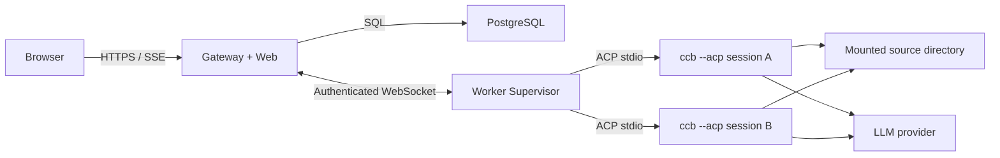

# DeepHarness 全栈 Agent Harness 实施计划

> 状态：设计草案  
> 日期：2026-07-27  
> 部署范围：私有、自用、研究环境  
> 前端框架：React + Vite + assistant-ui  
> Agent 内核：`vendor/claude-code`，通过 ACP stdio 协议调用

## 1. 背景与结论

当前工作区的主体是 `vendor/claude-code`。它已经具备完整的 Agent 主循环、工具系统、权限机制、模型选择、会话持久化、MCP、子 Agent 和 ACP 适配，但其内部模块高度耦合 Bun feature、进程级全局状态和 Claude Code 自身的 AppState。

DeepHarness 不直接修改或 fork 这些内部模块，而是在外层建设独立的全栈控制面。Agent Worker 通过启动 `ccb-bun --acp` 子进程调用内核。这样既能复用现有 Agent 能力，也能把上游更新风险限制在 ACP 兼容层。

本项目暂时只用于私有、自用和研究环境，不考虑商业发布、公共 SaaS 或公开分发镜像。即便如此，构建产物仍应保留在私有环境中，不主动发布包含 `vendor/claude-code` 的公共镜像。

## 2. 项目目标

### 2.1 必须实现

- 宿主机只需要 Docker、Docker Compose 和待操作的代码目录。
- 宿主机不需要安装或运行 Bun、Node.js、Python、数据库或 Agent CLI。
- `vendor/claude-code` 保持零业务修改，可以持续跟踪其上游仓库。
- 用户可以在浏览器中创建、查看、恢复和终止 Agent 会话。
- 支持流式文本、工具调用、工具结果、权限审批、Plan、错误和 usage 展示。
- 支持权限模式和模型切换。
- 支持 Agent 进程异常退出后的检测和会话恢复。
- 会话元数据、事件、审批记录和审计信息持久化到 PostgreSQL。
- Agent 对代码目录的读写只发生在 Worker 容器内。
- 提供完整的 Docker 健康检查、日志、测试和升级验证流程。

### 2.2 首版明确不做

- 公共 SaaS、多租户计费或商业分发。
- Kubernetes、跨节点 Worker 调度或自动扩缩容。
- 将 Docker Socket 挂载到业务容器。
- 浏览器直接连接 `ccb --acp`。
- 修改 `vendor/claude-code` 以适应 DeepHarness。
- 首版图片输入。当前上游 ACP 明确声明 `image: false`。
- GitHub、GitLab 等第三方 OAuth 登录。
- 手机 App、桌面客户端和 IDE 插件。

## 3. 核心技术决策

### 3.1 Vendor 管理

`vendor/claude-code` 应转换为外层仓库的 Git submodule，并固定到经过验证的 commit。

规则如下：

1. DeepHarness 业务代码不得写入 `vendor/claude-code`。
2. Docker 构建只使用外层仓库当前锁定的 submodule commit。
3. Docker 构建过程中禁止执行 `git pull` 或自动获取最新上游。
4. 上游升级必须经过独立的兼容性流水线。
5. 上游升级失败时只回退 submodule 指针，不为兼容新上游而临时修改 vendor。
6. CI 使用 HTTPS submodule URL，避免依赖宿主机 SSH Agent。

### 3.2 Agent 调用边界

唯一受支持的内核边界为 ACP：

```text
Worker Supervisor
    -> spawn ccb-bun --acp
    -> ACP NDJSON over stdin/stdout
    -> normalize to DeepHarness domain events
    -> authenticated WebSocket to Gateway
```

不允许从 DeepHarness 直接 import 以下内部模块：

- `QueryEngine`
- `query()`
- `getTools()`
- `AppState`
- `bootstrap/state`

这些模块可以被上游 ACP 实现间接使用，但不能成为 DeepHarness 的编译时依赖。

### 3.3 会话隔离

每个活跃 Harness 会话对应一个独立的 `ccb --acp` 子进程。

原因：Claude Code 内核仍使用进程级 session id、CWD、cost、model、settings cache 和 `process.chdir()`。同一 Agent 进程内并行运行多个会话可能发生状态污染。

第一阶段不要求每个会话一个 Docker 容器。一个 Worker 容器可以管理多个 Agent 子进程，但必须遵守：

- 一个子进程只承载一个活跃 Agent 会话。
- 每个子进程有独立 ACP Client、stderr 日志流和生命周期状态。
- Worker 设置最大并发数，超过后进入队列。
- 同一个物理工作区默认只允许一个写会话。

### 3.4 前端运行时

前端采用 `@assistant-ui/react` 的 `useExternalStoreRuntime`，并通过项目内部的 `HarnessRuntimeProvider` 进行二次封装。

不让页面组件直接依赖 ACP 或 Gateway 原始事件。依赖方向为：

```text
Gateway Event -> Harness Event Reducer -> Harness Message Model
              -> assistant-ui External Store Adapter
              -> assistant-ui primitives / tool UIs
```

锁定精确的 `assistant-ui` 版本，不使用宽松的 `^` 版本范围。所有 assistant-ui API 只允许出现在 `apps/web/src/features/chat/runtime/` 内，便于未来升级。

### 3.5 持久化边界

- PostgreSQL 是控制面事实来源：用户、工作区、会话、事件、命令、审批、usage、Worker 状态和审计日志。
- Claude Code 自身的 JSONL transcript 是 Agent 恢复上下文的事实来源。
- Gateway 不尝试从 UI 事件重建 Claude Code 的完整内部消息历史。
- 数据库中的 `harness_session_id` 与 ACP 返回的 `agent_session_id` 分开保存。

## 4. 总体架构



### 4.1 Docker 服务

| 服务 | 职责 | 是否接触代码目录 |
|---|---|---|
| `gateway` | API、登录、会话管理、事件持久化、SSE、静态前端 | 否 |
| `worker` | 工作区注册、ACP 子进程管理、命令执行、日志采集 | 是，只挂载到该服务 |
| `postgres` | 控制面持久化 | 否 |
| `test-model` | 仅测试 profile 使用的 Anthropic 兼容假服务 | 否 |

首版不引入 Redis。Gateway 单实例下，PostgreSQL 加内存连接表足够。未来需要多个 Gateway 实例时，再加入 Redis Streams 或 NATS。

## 5. 目标目录结构

```text
DeepHarness/
  apps/
    gateway/
      src/
        api/
        auth/
        db/
        events/
        worker-channel/
        server.ts
    web/
      src/
        app/
        api/
        components/
        features/
          chat/
            runtime/
            messages/
            tools/
            approvals/
          sessions/
          workspaces/
          settings/
    worker/
      src/
        acp/
        process/
        scheduler/
        workspace/
        gateway-channel/
        main.ts
  packages/
    protocol/
      src/
        commands.ts
        events.ts
        schemas.ts
    database/
      migrations/
      src/
    config/
      src/
  vendor/
    claude-code/
  docker/
    gateway.Dockerfile
    worker.Dockerfile
    test-model.Dockerfile
  tests/
    contract/
    integration/
    e2e/
    fixtures/
  docs/
    adr/
    operations/
    implementation-plan.md
  compose.yaml
  compose.test.yaml
  package.json
  bun.lock
```

## 6. 服务职责设计

### 6.1 Gateway

Gateway 使用 Bun + Hono，与上游 RCS 的技术栈保持接近，但不复用其内存 Store。

职责：

- 提供单用户登录和 HttpOnly session cookie。
- 提供工作区、会话、消息、审批、模型和权限模式 API。
- 接收 Worker 的注册、心跳、事件和完成状态。
- 将 Worker 事件持久化后再广播到浏览器。
- 为浏览器提供支持 `Last-Event-ID` 的 SSE 重放。
- 保存待执行命令，Worker 重连后可以继续拉取。
- 对每个 session 的命令和事件执行顺序校验与幂等去重。
- 服务 Vite 构建后的静态 Web 资源。

Gateway 不负责：

- 直接读取或写入用户代码。
- 直接运行 shell。
- 直接加载 Claude Code 内部模块。
- 保存 LLM API Key 到浏览器 localStorage。

### 6.2 Worker Supervisor

职责：

- 启动时注册自身、能力、挂载工作区和最大并发数。
- 维持到 Gateway 的带认证 WebSocket。
- 接收 `start_session`、`prompt`、`cancel`、`resolve_permission`、`set_mode`、`set_model` 和 `close_session` 命令。
- 为每个活跃会话创建一个 `AgentProcess`。
- 使用参数数组启动命令，不经过 shell 字符串拼接。
- 解析 ACP stdout，单独采集 stderr，避免协议流被日志污染。
- 将 ACP 通知转成 DeepHarness 领域事件。
- 在进程退出、超时、OOM 或协议错误时生成明确的 terminal event。
- 按空闲 TTL 回收进程，并在下一次 prompt 时通过 ACP resume 恢复。

Agent 子进程命令形态：

```text
bun /opt/claude-code/dist/cli-bun.js --acp
```

子进程需要：

- `cwd` 设置为会话工作区。
- 只接收环境变量白名单。
- 继承模型供应商凭据和必要代理变量。
- 使用单独的 AbortController、超时器和 stderr ring buffer。

### 6.3 PostgreSQL

数据库至少包含以下表：

#### `users`

- `id`
- `username`
- `password_hash`
- `created_at`
- `last_login_at`

首版只创建一个管理员账户，但仍使用正式密码哈希，不使用 UUID 作为身份。

#### `workspaces`

- `id`
- `name`
- `worker_id`
- `container_path`
- `mode`: `shared` 或 `worktree`
- `read_only`
- `metadata`
- `created_at`
- `updated_at`

#### `workers`

- `id`
- `name`
- `status`
- `capabilities`
- `max_concurrency`
- `last_heartbeat_at`
- `version`

#### `sessions`

- `id`: Harness session id
- `agent_session_id`: ACP/Claude Code session id
- `workspace_id`
- `worker_id`
- `title`
- `status`
- `permission_mode`
- `model_id`
- `active_turn_id`
- `last_event_seq`
- `created_at`
- `updated_at`
- `closed_at`

#### `turns`

- `id`
- `session_id`
- `user_message_id`
- `status`
- `stop_reason`
- `error_code`
- `started_at`
- `finished_at`

#### `session_events`

- `id`: UUID，作为幂等键
- `session_id`
- `turn_id`
- `seq`: 会话内单调递增序号
- `type`
- `payload`: JSONB
- `source`: `browser`、`gateway` 或 `worker`
- `created_at`

约束：`UNIQUE(session_id, seq)` 和 Worker 事件 id 唯一约束。

#### `session_commands`

- `id`
- `session_id`
- `type`
- `payload`
- `status`: `pending`、`delivered`、`acked`、`failed`
- `attempt_count`
- `created_at`
- `acked_at`

#### `permission_requests`

- `id`
- `session_id`
- `turn_id`
- `tool_call_id`
- `tool_name`
- `input`
- `status`: `pending`、`approved`、`denied`、`expired`
- `decision`
- `created_at`
- `resolved_at`

#### `usage_records`

- `id`
- `session_id`
- `turn_id`
- `model_id`
- `input_tokens`
- `output_tokens`
- `cache_read_tokens`
- `cache_write_tokens`
- `cost_usd`
- `created_at`

#### `audit_logs`

- `id`
- `actor_id`
- `action`
- `resource_type`
- `resource_id`
- `metadata`
- `created_at`

## 7. 领域协议

### 7.1 浏览器到 Gateway 命令

统一命令类型：

```text
session.create
session.prompt
session.cancel
session.close
session.set_mode
session.set_model
permission.resolve
```

每个写命令必须带客户端生成的 idempotency key。Gateway 先写 `session_commands`，再向 Worker 投递。

### 7.2 Gateway 到浏览器事件

统一事件类型：

```text
session.created
session.status_changed
turn.started
user.message_created
assistant.message_started
assistant.text_delta
assistant.reasoning_delta
assistant.message_completed
tool.call_started
tool.call_updated
tool.call_completed
permission.requested
permission.resolved
plan.updated
usage.updated
turn.completed
turn.failed
session.interrupted
worker.disconnected
```

所有事件使用相同 envelope：

```json
{
  "id": "event_uuid",
  "sessionId": "session_uuid",
  "turnId": "turn_uuid_or_null",
  "seq": 42,
  "type": "assistant.text_delta",
  "timestamp": "2026-07-27T12:00:00.000Z",
  "payload": {}
}
```

ACP 原始 payload 可以作为调试字段选择性保存，但前端不能依赖它。

### 7.3 顺序和重放

- Gateway 对同一 session 的事件串行入库。
- 事件写入数据库成功后才向 SSE 订阅者广播。
- 浏览器保存最后一个 `seq`，重连时通过 `Last-Event-ID` 请求缺失事件。
- Delta 事件可以在会话结束后异步压缩，但原始审计事件在首版保留。
- Worker 重复发送相同事件 id 时，Gateway 返回已有 seq，不重复广播。

## 8. assistant-ui 前端设计

### 8.1 技术栈

- React 19
- Vite
- TypeScript strict
- `@assistant-ui/react`，固定精确版本
- Tailwind CSS
- Radix UI primitives
- Lucide React
- TanStack Query 仅处理非流式服务端数据
- Vitest + Testing Library
- Playwright 端到端测试

### 8.2 Runtime 封装

创建 `HarnessRuntimeProvider`：

```text
HarnessRuntimeProvider
  -> useSessionEventStore(sessionId)
  -> reduce Harness events to message state
  -> useExternalStoreRuntime({
       messages,
       isRunning,
       onNew,
       onCancel,
       onAddToolResult
     })
  -> AssistantRuntimeProvider
```

职责：

- 将用户提交映射为 `session.prompt`。
- 将取消操作映射为 `session.cancel`。
- 将 DeepHarness message model 转成 assistant-ui `ThreadMessageLike`。
- 将工具审批结果映射为 `permission.resolve`。
- 维护流式 delta 合并、幂等和重放逻辑。
- 在切换 session 时销毁旧 SSE 连接和未完成状态。

页面和工具组件不得自行调用 `useExternalStoreRuntime`。

### 8.3 消息映射

| DeepHarness 数据 | assistant-ui 表示 |
|---|---|
| 用户文本 | user message + text part |
| Assistant 文本 | assistant message + text part |
| Reasoning | reasoning part，默认折叠 |
| Tool call | tool-call part |
| Tool result | tool-call result/status 更新 |
| Permission | tool approval 或专用 inline approval UI |
| Plan | data part + `PlanView` 自定义 renderer |
| Error | message error/status，而不是伪造 Assistant 文本 |
| Usage | session/turn metadata，不进入消息正文 |

### 8.4 首版页面

#### 会话工作台 `/`

- 左侧：会话列表、状态、最后活动时间、新建会话。
- 中间：assistant-ui Thread、流式消息、工具调用、输入区。
- 右侧：可折叠的 Session Inspector，显示模型、权限模式、usage、工作区和 Worker 状态。
- 移动端：会话列表和 Inspector 使用抽屉，不与主对话重叠。

#### 工作区设置 `/settings/workspaces`

- 显示 Worker 上报的挂载目录。
- 配置名称、读写模式和并发策略。
- 不允许用户在浏览器输入任意宿主机路径；只能选择 Worker 已声明的容器内路径。

#### 系统设置 `/settings/system`

- 默认模型。
- 默认权限模式。
- 最大并发。
- Agent 空闲回收时间。
- 只显示密钥是否配置，不回显密钥值。

### 8.5 必须支持的 UI 状态

- 初始加载和历史重放。
- Worker 离线。
- Agent 正在启动。
- 正在生成。
- Prompt 已排队。
- 等待权限审批。
- 用户取消。
- Agent 崩溃。
- Gateway SSE 断线和自动重连。
- 会话已关闭。
- 数据库历史存在但 Agent transcript 无法恢复。

## 9. 会话生命周期

### 9.1 创建会话

1. 浏览器提交工作区、权限模式和模型。
2. Gateway 创建 Harness session，状态为 `queued`。
3. Gateway 写入 `start_session` command。
4. Worker 获取工作区写锁并启动新的 `ccb --acp` 子进程。
5. Worker 执行 ACP `initialize`。
6. Worker 执行 ACP `session/new`。
7. Worker 将返回的 `agent_session_id` 上报 Gateway。
8. Gateway 更新状态为 `idle`。

### 9.2 执行 Prompt

1. Gateway 为 prompt 创建 turn 和 command。
2. Worker ACK command，session 进入 `running`。
3. Worker 调用 ACP `session/prompt`。
4. ACP notifications 被转成领域事件并发送 Gateway。
5. Gateway 持久化并通过 SSE 推送。
6. ACP 返回 stop reason 后，Worker 上报 `turn.completed` 或 `turn.failed`。
7. Gateway 更新 session 为 `idle`、`waiting_permission` 或 `error`。

### 9.3 权限审批

1. ACP Client 收到 permission request 后暂停对应 Promise。
2. Worker 发送 `permission.requested`。
3. Gateway 创建 `permission_requests` 记录。
4. 浏览器展示工具名、输入、风险说明和允许选项。
5. 用户决定后，Gateway 持久化 decision，再发送 `permission.resolve`。
6. Worker 检查 request/session/turn 是否仍匹配，再解析 ACP Promise。
7. 超时、Worker 断开或 session 关闭时默认拒绝。

### 9.4 进程回收和恢复

- session 空闲超过默认 15 分钟后，Worker 优雅关闭 Agent 进程。
- PostgreSQL session 保持 `idle`，并记录 `process_state=stopped`。
- 新 prompt 到来时启动新进程，执行 ACP initialize 后使用 `session/resume`。
- UI 历史由 PostgreSQL 提供，因此恢复时优先使用不重放历史通知的 resume。
- 若 resume 失败，尝试 load 并以事件 id 去重。
- 两者都失败时 session 进入 `recovery_required`，不得静默创建空白会话。

## 10. 工作区策略

### 10.1 Shared 模式

Agent 直接操作挂载到 `/workspace/source` 的宿主机代码目录。

- 优点：修改立即出现在宿主机。
- 缺点：多个写会话会互相干扰。
- 首版默认：同一 workspace 只能有一个 `running` 或 `waiting_permission` 会话。

### 10.2 Worktree 模式

对于 Git 仓库，可在容器数据卷中创建独立 worktree。

- 每个会话使用 `/workspace/runs/<session-id>`。
- 原仓库 `.git` 仍来自挂载目录。
- UI 明确显示 branch/worktree 路径。
- 会话结束后不会自动删除有未提交修改的 worktree。

Worktree 模式放在 Shared 模式垂直切片完成后实现。

### 10.3 非 Git 目录

首版只支持 Shared 模式，不自动复制整个目录。后续可以增加 snapshot/copy 模式，但必须有容量限制和清理策略。

## 11. Docker 设计

### 11.1 Worker 镜像

多阶段构建：

1. `vendor-deps`：基于固定 Bun 版本安装 vendor 依赖。
2. `vendor-build`：执行 vendor 的 typecheck、必要测试和 build。
3. `worker-build`：构建 DeepHarness Worker。
4. `worker-runtime`：只复制 vendor dist、Worker dist、ripgrep/native runtime 和必要系统工具。

Worker runtime 应包含：

- Bun 固定版本。
- `git`、`bash`、`ripgrep`、`ca-certificates`。
- 非 root 用户 `agent`。
- `/home/agent/.claude` 持久卷。
- `/workspace/source` 代码挂载。
- `/workspace/runs` 命名卷。
- `/tmp` tmpfs。

### 11.2 Gateway 镜像

1. 安装 workspace 依赖。
2. 构建 React/Vite 前端。
3. 构建 Hono Gateway。
4. runtime 只复制构建产物和 migration runner。

Gateway 不挂载宿主机源代码目录。

### 11.3 Compose 配置

计划中的主要挂载：

```yaml
services:
  worker:
    volumes:
      - ${HOST_WORKSPACE_PATH:?required}:/workspace/source
      - agent-home:/home/agent/.claude
      - agent-runs:/workspace/runs
  postgres:
    volumes:
      - postgres-data:/var/lib/postgresql/data
```

安全默认值：

- Gateway 默认只绑定 `127.0.0.1`。
- Worker 和 PostgreSQL 只加入内部 Docker network。
- 不挂载 `/var/run/docker.sock`。
- `cap_drop: [ALL]`，按验证结果增加最小能力。
- `init: true`，确保正确回收 Agent 子进程。
- 设置 CPU、内存和 PID 上限。
- 使用 Docker secrets 或只读 env file 注入凭据。
- API Key 不写入镜像层、不写入前端 bundle、不打印到日志。

### 11.4 宿主机唯一操作入口

开发、测试、运行统一由 Docker 命令完成：

```text
docker compose build
docker compose up -d
docker compose logs -f gateway worker
docker compose run --rm migrate
docker compose -f compose.yaml -f compose.test.yaml run --rm test
```

仓库脚本可以封装这些命令，但脚本本身不得调用宿主机 Bun、Node 或 Python。

## 12. 配置与密钥

首版配置分三类：

### 构建配置

- Bun 版本。
- vendor commit。
- assistant-ui 精确版本。
- DeepHarness build version。

### Gateway 运行配置

- PostgreSQL DSN。
- session cookie secret。
- bootstrap admin password 或 password hash。
- Gateway/Worker shared token。
- bind host/port。

### Worker 运行配置

- Worker id/name。
- 最大 Agent 进程数。
- 工作区容器路径。
- Agent 空闲 TTL。
- Anthropic/OpenAI/Gemini 等供应商变量白名单。

Worker 只能将批准的环境变量传给 Agent 子进程。所有名称包含 `TOKEN`、`KEY`、`SECRET` 的值在日志中统一遮蔽。

## 13. 安全基线

虽然暂不考虑商业部署，仍采用以下最低安全要求：

- 不使用现有 RCS 的任意 UUID 所有权模型。
- 同源 HttpOnly、Secure、SameSite session cookie。
- 所有写请求验证 CSRF token 或严格 Origin。
- Gateway 到 Worker 使用独立的长随机 token。
- Worker 只能声明预配置工作区，浏览器不能提交任意文件系统路径。
- 权限审批必须绑定 session、turn、tool call 和过期时间。
- `bypassPermissions` 默认关闭，并在 UI 中标记为高风险模式。
- Agent 以非 root 用户运行。
- Gateway 日志不记录 prompt 全文和工具输出，调试模式另行显式开启。
- 所有下载、文件预览和 artifact 路径必须做工作区边界校验。
- 对登录、创建会话、提交 prompt 和审批接口做基础速率限制。

## 14. 可观测性

### 14.1 结构化日志

统一字段：

```text
timestamp
level
service
request_id
worker_id
session_id
turn_id
agent_process_id
event_type
duration_ms
error_code
```

Agent stderr 进入按 session 隔离的 ring buffer，默认不写入数据库全文。错误发生时保存末尾有限行数，并做密钥遮蔽。

### 14.2 指标

- 在线 Worker 数。
- 活跃/排队 Agent 进程数。
- session 和 turn 状态数量。
- 首 token 延迟、turn 总耗时。
- ACP request/notification/error 数量。
- permission 等待时间。
- Worker 重启和 Agent crash 次数。
- token usage 和已知 cost。
- SSE 当前连接数和重连数。

首版提供 `/health/live`、`/health/ready` 和简单 Prometheus `/metrics`。

## 15. 测试策略

### 15.1 单元测试

- ACP 到领域事件映射。
- 事件 reducer 和 delta 合并。
- assistant-ui message converter。
- session 状态机。
- command/event 幂等。
- permission 状态机。
- 环境变量白名单和日志遮蔽。
- 工作区路径校验。

### 15.2 数据库集成测试

- migration 从空库执行。
- session 内 seq 并发分配。
- 重复 Worker event 去重。
- command ACK/retry。
- Gateway 重启后的 pending command 恢复。
- SSE 按 Last-Event-ID 重放。

### 15.3 ACP Contract Tests

每次 vendor 更新必须覆盖：

1. `initialize`。
2. `session/new`。
3. 普通文本 prompt。
4. 流式 Assistant delta。
5. 工具调用和工具结果。
6. permission request/response。
7. cancel。
8. list/load/resume session。
9. set mode。
10. set model。
11. Agent 异常退出。
12. stderr 不污染 stdout ACP 流。

Contract test 使用 Docker 内的 Anthropic 兼容假模型服务，测试过程不产生真实 API 费用。

### 15.4 浏览器 E2E

使用 Playwright，在 Docker test profile 中验证：

- 登录。
- 创建 session。
- 发送消息并看到流式输出。
- 展开工具调用。
- 批准和拒绝权限。
- 中断生成。
- 刷新页面后恢复历史。
- Gateway 重启后继续重放。
- Worker 重启后 session resume。
- 桌面和移动 viewport 无重叠。

### 15.5 Docker 验收

CI 不安装宿主机语言运行时，只执行 Docker 命令。最终门禁：

```text
docker compose build
docker compose -f compose.yaml -f compose.test.yaml run --rm test
docker compose up -d
docker compose ps --format json
```

所有服务必须 healthy，测试结束后不得遗留 Agent 子进程。

## 16. 上游升级流程

### 16.1 升级步骤

1. 查询上游 tag 和 main commit，不直接修改当前 submodule。
2. 创建单独升级分支。
3. 更新 submodule 指针。
4. 构建 vendor builder stage。
5. 运行 vendor typecheck 和上游关键测试。
6. 运行 DeepHarness ACP contract tests。
7. 运行数据库、集成和 Playwright 测试。
8. 生成兼容性报告：新增 capability、删除字段、事件差异、镜像大小变化。
9. 人工批准后合并 submodule 指针。

### 16.2 兼容策略

- ACP capability 必须运行时协商，不按 vendor 版本号猜测。
- 未识别通知保存到 debug log，但不能使会话崩溃。
- 缺少可选 capability 时在 UI 隐藏对应控件。
- ACP 核心 capability 缺失时 Worker 拒绝注册 ready。
- 不使用自动最新版镜像标签；镜像标签同时包含 DeepHarness 版本和 vendor commit 短 hash。

## 17. 分阶段实施

### 阶段 0：仓库与架构基线

任务：

- 初始化外层 Git 仓库。
- 将现有 vendor 转换为 submodule，固定当前 commit。
- 建立 Bun workspace，但所有 Bun 命令只在 Docker 内运行。
- 创建 `apps/`、`packages/`、`docker/` 和 `tests/` 基础结构。
- 写入 ADR：ACP 边界、单会话单进程、PostgreSQL 事件存储、无 Docker Socket。
- 建立 Compose 网络、PostgreSQL 和空 Gateway/Worker 健康检查。

验收：

- `git status` 不包含 vendor 内部修改。
- `docker compose up` 可以启动 Gateway、Worker 和 PostgreSQL。
- 宿主机不需要 Bun/Node。

### 阶段 1：最小垂直链路

任务：

- 构建 vendor `ccb-bun` runtime image layer。
- Worker 实现 ACP 子进程 spawn、initialize、new session 和 prompt。
- Gateway 实现 Worker 注册、单 session API、事件表和 SSE。
- Web 接入 assistant-ui External Store Runtime。
- 实现纯文本用户消息和 Assistant 流式文本。
- 实现 interrupt 和基础错误展示。
- 只支持一个 Shared workspace、一个并发会话。

验收：

- 从空环境执行 `docker compose up` 后可在浏览器完成一次真实对话。
- Agent 能读取挂载代码并返回结果。
- 点击停止可以中断运行。
- 刷新浏览器后历史仍存在。

### 阶段 2：完整 Agent 交互

任务：

- ACP 工具调用和工具结果映射。
- assistant-ui tool UI registry。
- 权限 request/approve/deny/timeout 全链路。
- Plan 自定义 renderer。
- 模型选择和权限模式选择。
- prompt 排队和运行状态。
- usage、stop reason 和错误分类。
- Session Inspector。

验收：

- 文件读取、编辑和 Bash 等工具能正确显示输入、状态和结果。
- 危险工具在执行前必须获得审批。
- 工具审批在刷新页面后仍可继续处理。
- 模型和权限模式变更能同步到 ACP session。

### 阶段 3：持久化和恢复

任务：

- 完成全部数据库表和 migration。
- Worker command ACK/retry。
- Agent idle TTL 和优雅关闭。
- ACP resume/load 策略。
- Gateway、Worker 和浏览器断线重连。
- 事件幂等、SSE replay 和历史分页。
- transcript 缺失/损坏检测。

验收：

- 重启 Gateway 不丢失会话和历史。
- 重启 Worker 后可以恢复已有会话继续提问。
- 同一 Worker event 重发不会产生重复消息。
- Agent 无法恢复时 UI 明确显示原因，不创建伪装成功的新会话。

### 阶段 4：工作区与并发

任务：

- 多工作区注册。
- Shared workspace 写锁。
- 每会话独立 Agent 子进程。
- Worker 最大并发和排队。
- Git worktree 模式。
- CPU、内存、PID 和超时控制。
- 僵尸进程、孤儿锁和异常 worktree 清理。

验收：

- 两个不同工作区可以并行运行。
- 同一 Shared workspace 不会发生两个并发写 turn。
- 一个 Agent 崩溃不会影响其他 session。
- Worker 退出后所有子进程均被正确回收。

### 阶段 5：完整产品化与运维

任务：

- 单用户正式登录、cookie、CSRF、速率限制。
- 系统设置和工作区设置页面。
- 结构化日志、metrics 和健康检查。
- 数据库备份/恢复文档。
- vendor 升级脚本和兼容报告。
- 全量 Docker E2E。
- 移动端和桌面视觉验证。
- 操作手册、故障排查和升级回滚文档。

验收：

- 所有日常操作只需 Docker Compose。
- 数据库可以备份后恢复到新环境。
- vendor commit 更新失败时能够恢复旧镜像和 submodule 指针。
- 文档覆盖安装、启动、停止、升级、备份和常见故障。

## 18. 完成定义

DeepHarness v1 只有满足以下条件才算完成：

- `vendor/claude-code` 无业务修改。
- 只通过 ACP 调用 Agent 内核。
- 每个活跃 session 使用独立 Agent 进程。
- assistant-ui 覆盖文本、工具、审批、Plan、错误和运行状态。
- Gateway、Worker 或浏览器任意一个短暂重启后可以恢复。
- 会话、事件和审批不会因容器重启而丢失。
- 同一 Shared workspace 的写并发受到约束。
- Agent 和 Gateway 均以非 root 用户运行。
- 宿主机无 Bun、Node 或 Python 运行要求。
- 从构建、migration、测试到运行全部可通过 Docker Compose 完成。
- vendor 升级有自动 contract test 和人工批准门禁。

## 19. 主要风险与应对

| 风险 | 影响 | 应对 |
|---|---|---|
| 上游 ACP 行为快速变化 | Worker 失效 | 固定 commit、capability 协商、contract tests |
| 内核进程级全局状态 | 多会话污染 | 单会话单进程 |
| Shared workspace 并发修改 | 文件冲突 | 默认写锁，后续 worktree |
| Agent 崩溃导致等待审批悬挂 | UI 卡住 | 进程终止时自动 expire/deny |
| SSE 重连产生重复 delta | 重复消息 | session seq + event id 幂等 |
| transcript 与数据库历史不一致 | 无法恢复 | 分离事实来源，显式 recovery state |
| assistant-ui API 变化 | 前端升级成本 | 精确版本 + 单一 runtime wrapper |
| 机密出现在日志 | 凭据泄露 | env 白名单、统一 redact、默认不记录正文 |
| Worker 对挂载目录权限过大 | 文件风险 | 仅挂载明确目录、非 root、权限模式默认安全 |

## 20. 预计工作量

以一名熟悉 TypeScript、Docker 和流式协议的开发者估算：

| 阶段 | 预计投入 |
|---|---|
| 阶段 0 | 2-3 人日 |
| 阶段 1 | 5-7 人日 |
| 阶段 2 | 5-7 人日 |
| 阶段 3 | 4-6 人日 |
| 阶段 4 | 4-6 人日 |
| 阶段 5 | 4-6 人日 |

完整 v1 约 24-35 人日。最小可用的单工作区垂直链路可在阶段 1 结束时形成，约 7-10 人日。估算不包含上游缺陷修复和真实模型供应商兼容问题。

## 21. 首个实现批次

正式开始编码时，第一批应严格限制在以下内容：

1. 外层仓库和 submodule 结构。
2. `gateway`、`worker`、`postgres` 三服务 Compose。
3. vendor Docker build stage 和 `ccb-bun --acp` 启动验证。
4. ACP initialize/new/prompt/cancel 最小 Client。
5. PostgreSQL session/event 两张最小表。
6. 单 workspace、单 session API。
7. assistant-ui `HarnessRuntimeProvider` 和纯文本流式对话。
8. Docker 内 contract test 和 Playwright smoke test。

第一批不得提前加入多用户、worktree、插件市场、文件预览或复杂设置页面。先证明 ACP、持久事件、assistant-ui 和 Docker 四条主链路可以稳定闭环，再扩展完整功能。
