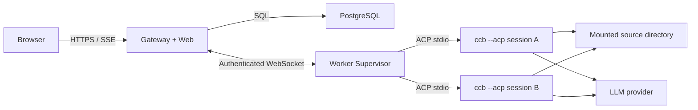

# DeepHarness 全栈 Agent Harness 实施计划

> 状态：设计草案  
> 日期：2026-07-27  
> 部署范围：私有、自用、研究环境  
> 前端框架：React + Vite + assistant-ui  
> Agent 内核：`vendor/claude-code`，通过 ACP stdio 协议调用

## 1. 背景与结论

当前工作区的主体是 `vendor/claude-code`。它已经具备覆盖面很广的 Agent 主循环、工具系统、权限机制、模型选择、会话持久化、MCP、子 Agent、任务/团队、Skills、Goal/Workflow/Cron、记忆与上下文管理以及 ACP 适配，但其内部模块高度耦合 Bun feature、进程级全局状态和 Claude Code 自身的 AppState。

DeepHarness 不直接修改或 fork 这些内部模块，而是在外层建设独立的全栈控制面。Agent Worker 通过启动 `ccb-bun --acp` 子进程调用内核。这样既能复用现有 Agent 能力，也能把上游更新风险限制在 ACP 兼容层。

本项目暂时只用于私有、自用和研究环境，不考虑商业发布、公共 SaaS 或公开分发镜像。即便如此，构建产物仍应保留在私有环境中，不主动发布包含 `vendor/claude-code` 的公共镜像。

## 2. 项目目标

### 2.1 必须实现

- 宿主机只需要 Docker、Docker Compose 和待操作的代码目录。
- 宿主机不需要安装或运行 Bun、Node.js、Python、数据库或 Agent CLI。
- `vendor/claude-code` 保持零业务修改，可以持续跟踪其上游仓库。
- 用户可以在浏览器中创建、查看、恢复和终止 Agent 会话。
- 支持流式文本、工具调用、工具结果、权限审批、Plan、错误和 usage 展示。
- 支持权限模式和模型切换。
- 支持 Agent 进程异常退出后的检测和会话恢复。
- 会话元数据、事件、审批记录和审计信息持久化到 PostgreSQL。
- Agent 对代码目录的读写只发生在 Worker 容器内。
- 提供完整的 Docker 健康检查、日志、测试和升级验证流程。
- 建立自动生成的 vendor capability manifest，覆盖内置工具、构建 feature、ACP capability、命令、Agent 定义、模型供应商和平台集成。
- 将 vendor 中发现的每项能力归入“完整支持、明确降级、ACP/平台阻塞、非 Agent 核心”之一，并保存验证证据；不允许静默遗漏。
- 尽量通过 ACP 原生继承 `QueryEngine` 和 `getTools()` 已装配的全部 Agent 核心能力，并为需要交互的能力补齐 Gateway 协议、持久化和 assistant-ui 界面。
- 每次 vendor 升级生成 capability diff；新增、删除、禁用或行为变化的能力必须经过测试和人工确认。

### 2.2 首版明确不做

- 公共 SaaS、多租户计费或商业分发。
- Kubernetes、跨节点 Worker 调度或自动扩缩容。
- 将 Docker Socket 挂载到业务容器。
- 浏览器直接连接 `ccb --acp`。
- 修改 `vendor/claude-code` 以适应 DeepHarness。
- 首个垂直切片不处理图片输入；全矩阵阶段必须支持图片/文件输出，并将图片输入保留为明确的 ACP 阻塞项，待上游 ACP 支持或外部兼容层能够无侵入实现后启用。
- GitHub、GitLab 等第三方 OAuth 登录。
- 手机 App、桌面客户端和 IDE 插件。
- 复刻 Claude Code 的终端 TUI、主题、Updater、Buddy/陪伴角色等非 Agent 核心体验。

## 3. 核心技术决策

### 3.1 Vendor 管理

`vendor/claude-code` 应转换为外层仓库的 Git submodule，并固定到经过验证的 commit。

规则如下：

1. DeepHarness 业务代码不得写入 `vendor/claude-code`。
2. Docker 构建只使用外层仓库当前锁定的 submodule commit。
3. Docker 构建过程中禁止执行 `git pull` 或自动获取最新上游。
4. 上游升级必须经过独立的兼容性流水线。
5. 上游升级失败时只回退 submodule 指针，不为兼容新上游而临时修改 vendor。
6. CI 使用 HTTPS submodule URL，避免依赖宿主机 SSH Agent。

### 3.2 Agent 调用边界

唯一受支持的内核边界为 ACP：

```text
Worker Supervisor
    -> spawn ccb-bun --acp
    -> ACP NDJSON over stdin/stdout
    -> normalize to DeepHarness domain events
    -> authenticated WebSocket to Gateway
```

不允许从 DeepHarness 直接 import 以下内部模块：

- `QueryEngine`
- `query()`
- `getTools()`
- `AppState`
- `bootstrap/state`

这些模块可以被上游 ACP 实现间接使用，但不能成为 DeepHarness 的编译时依赖。

### 3.3 会话隔离

每个活跃 Harness 会话对应一个独立的 `ccb --acp` 子进程。

原因：Claude Code 内核仍使用进程级 session id、CWD、cost、model、settings cache 和 `process.chdir()`。同一 Agent 进程内并行运行多个会话可能发生状态污染。

第一阶段不要求每个会话一个 Docker 容器。一个 Worker 容器可以管理多个 Agent 子进程，但必须遵守：

- 一个子进程只承载一个活跃 Agent 会话。
- 每个子进程有独立 ACP Client、stderr 日志流和生命周期状态。
- Worker 设置最大并发数，超过后进入队列。
- 同一个物理工作区默认只允许一个写会话。

### 3.4 前端运行时

前端采用 `@assistant-ui/react` 的 `useExternalStoreRuntime`，并通过项目内部的 `HarnessRuntimeProvider` 进行二次封装。

不让页面组件直接依赖 ACP 或 Gateway 原始事件。依赖方向为：

```text
Gateway Event -> Harness Event Reducer -> Harness Message Model
              -> assistant-ui External Store Adapter
              -> assistant-ui primitives / tool UIs
```

锁定精确的 `assistant-ui` 版本，不使用宽松的 `^` 版本范围。所有 assistant-ui API 只允许出现在 `apps/web/src/features/chat/runtime/` 内，便于未来升级。

### 3.5 持久化边界

- PostgreSQL 是控制面事实来源：用户、工作区、会话、事件、命令、审批、usage、Worker 状态和审计日志。
- Claude Code 自身的 JSONL transcript 是 Agent 恢复上下文的事实来源。
- Gateway 不尝试从 UI 事件重建 Claude Code 的完整内部消息历史。
- 数据库中的 `harness_session_id` 与 ACP 返回的 `agent_session_id` 分开保存。

### 3.6 Vendor 全功能矩阵

全功能不等于把所有功能重新实现一遍。ACP 的 `createSession` 会调用 `getTools()`，加载 commands 和 Agent definitions，并用这些对象构造 `QueryEngine`；因此大量能力已经在内核进程中原生运行。DeepHarness 的责任是确认这些能力可从 ACP 到达、补齐浏览器交互和持久化，并明确记录无法从 ACP 到达的部分。

矩阵状态定义：

| 代码 | 状态 | 判定标准 |
|---|---|---|
| `A` | 原生继承 | ACP 会话内直接由 vendor `QueryEngine`/工具系统执行；Harness 只做通用事件转发也能完成任务 |
| `B` | Harness 适配 | 内核能力可用，但必须增加命令、事件、数据库模型或专用 UI 才能完整使用 |
| `C` | ACP 缺口 | vendor 内核具备能力，但当前 ACP 路径未装配、未声明或丢失必要输入/输出；禁止修改 vendor 绕过 |
| `D` | Docker/平台限制 | 依赖本地 TTY、桌面、音频、系统通知、SSH 主机环境或外部服务；仅在容器条件满足时提供 |
| `E` | 非 Agent 核心 | Updater、主题、终端布局、测试工具等不影响 Agent Harness 核心执行，记录但不复刻 |

能力矩阵以当前锁定的 vendor commit 为基线。表中“目标”是默认归类，最终状态由 Docker 内 capability probe 和 contract test 结果决定，不能只依据源码名称判断。

| 能力域 | Vendor 能力/工具 | 当前 ACP 可达性 | DeepHarness 目标 | 需要建设的 Harness 能力 |
|---|---|---|---|---|
| Agent 主循环 | `QueryEngine`、流式消息、reasoning、stop reason、cancel、usage | 已由 ACP session 使用 | `A+B` | 统一事件、取消、usage/错误展示、恢复测试 |
| 模型与上下文 | 模型选择、token budget、prompt cache、Ultrathink、Ultraplan、Lodestone、auto compact | 主循环可继承，部分状态没有标准 ACP 事件 | `A+B` | 模型/预算配置、上下文与压缩状态事件、Inspector |
| 文件操作 | `FileRead`、`FileWrite`、`FileEdit`、`NotebookEdit` | 通过 `getTools()` 原生装配 | `A+B` | 权限审批、diff/Notebook renderer、路径边界、下载与预览 |
| Shell 与搜索 | `Bash`、`PowerShell`、`Glob`、`Grep`、`REPL` | Bash/Glob/Grep 可继承；PowerShell/REPL 取决于平台和 feature | `A+B+D` | 流式输出、进程状态、超时、平台 capability 标记 |
| 计划与待办 | `EnterPlanMode`、`ExitPlanMode`、`VerifyPlanExecution`、`TodoWrite`、`Brief` | 工具可继承，模式可经 ACP 设置 | `A+B` | Plan、Todo、验证结果和 brief 专用视图 |
| 用户交互 | `AskUserQuestion`、permission modes、`Config` | permission 有 ACP bridge；Ask/Config 需验证事件语义 | `A+B` | 问题表单、审批、超时、配置变更审计 |
| 子 Agent | `AgentTool`、内置 Explore/Plan Agent、项目自定义 Agent definitions、verification Agent | ACP 创建 session 时加载 Agent definitions | `A+B` | 子 Agent 树、状态、输出、父子关联和中止 |
| 任务系统 | `TaskCreate/Get/List/Update/Output/Stop`、`SyntheticOutput` | feature 开启时由工具系统提供 | `A+B` | 任务持久投影、列表/详情、进度、输出和终止 UI |
| 团队与协调 | `TeamCreate/Delete`、`SendMessage`、`ListPeers`、coordinator mode | 内核可启用；多进程/邮箱行为需实测 | `A+B+D` | team/peer 拓扑、消息、Worker 生命周期和资源配额 |
| Skills | `SkillTool`、`DiscoverSkills`、skill search/learning | prompt commands 与工具可继承；本地 TUI 命令不可见 | `A+B+C` | Skills 清单、启用状态、执行 renderer、命令可见性报告 |
| Commands | 项目/用户命令、prompt slash commands、local/local-jsx commands | ACP 只发布可见的 `prompt` commands | `A+B+C` | 命令面板、参数提示；local/local-jsx 明确标为 ACP 阻塞 |
| Hooks/Plugins | settings、hooks、plugins、工具搜索、`SearchExtraTools`、`ExecuteTool` | 内核加载路径需逐项探测，ACP 无统一管理面 | `A+B+C` | 插件/Hook 状态、错误日志、启停配置和兼容报告 |
| MCP 工具 | 动态 `MCPTool`、MCP server 配置、tool deny rules | ACP 接受 `mcpServers`，但当前 `createSession` 将 `mcpClients` 固定为 `[]` | `C` | 先做配置/状态 UI 与阻塞测试；等待上游修复后补工具事件 |
| MCP 资源与认证 | `ListMcpResources`、`ReadMcpResource`、`McpAuth`/OAuth | 内置资源工具存在，但客户端装配和浏览器 OAuth 回调不完整 | `B+C` | MCP server registry、OAuth callback、资源浏览、健康状态 |
| 记忆 | `LocalMemoryRecall`、`VaultHttpFetch`、memory extraction、team memory | 部分工具可继承；team memory 默认未编译 | `A+B+D` | 记忆来源/命中/错误展示、开关与数据生命周期 |
| 会话上下文 | transcript、resume/load/fork、compact、rewind、history snip/context collapse | ACP 支持 list/load/resume；部分 TUI 命令或 feature 被禁用 | `A+B+C` | 会话分支、恢复、压缩检查点、能力状态；禁用项不伪装支持 |
| Goal | `GoalTool`、持续目标、自动续跑、完成/阻塞审计 | 默认 build feature 开启，工具可继承 | `A+B` | Goal 状态机、预算/续跑、审批边界、时间线和 Docker 重启恢复 |
| Workflow | `WorkflowTool`、`.claude/workflows` 脚本 | build feature 开启，ACP 路径需 contract test | `A+B` | 定义/运行/步骤/输出、取消、重试和审计 UI |
| Cron/Kairos | `ScheduleCron`/cron tools、Kairos、brief/away summary | 依赖 daemon/长驻进程，空闲回收会影响语义 | `B+D` | 调度持久化、容器时区、错过执行策略、Worker 重启恢复 |
| 后台任务 | background sessions、`Sleep`、`Monitor`、`RemoteTrigger`、agent triggers | feature 开启；ACP 生命周期与附着语义需验证 | `A+B+D` | background job 表、日志流、attach/stop、限额、孤儿回收 |
| Artifacts/文件输出 | `ArtifactTool`、`ReviewArtifact`、`SendUserFile`、`Snip` | 部分 feature 默认关闭；ACP 可发送图片输出但需 Harness 映射 | `A+B+D` | artifact registry、预览/下载、图片输出、工作区路径校验 |
| 图片/二进制输入 | ACP image/resource/blob content block | prompt conversion 仅转文本/资源元数据，图片输入未送入模型 | `C` | UI 可选择文件但在 capability 可用前禁用提交；保留阻塞证据 |
| 代码智能 | `LSPTool`、诊断/定义/引用 | 需 `ENABLE_LSP_TOOL` 和容器内 language server | `A+B+D` | language server 镜像 profile、诊断/位置 renderer、能力检测 |
| Web | `WebFetch`、`WebSearch`、`WebBrowser` | Fetch/Search 可继承；Browser 依赖 feature/浏览器运行时 | `A+B+D` | 引用/来源 UI、网络策略、可选 Playwright/Chromium profile |
| 远程与终端 | `TerminalCapture`、SSH remote、bridge/direct-connect、server/open | 主要面向 TTY/远程控制，不是标准 ACP 会话能力 | `C+D` | 仅做可选平台 profile；不得削弱容器和工作区边界 |
| 通知与外部协作 | `PushNotification`、`SubscribePR`、`SuggestBackgroundPR`、autofix PR | 依赖外部凭据、回调或平台服务 | `B+D` | integration 配置、凭据状态、通知/PR 事件和明确 opt-in |
| 语音与桌面 | voice mode、系统通知、桌面/IDE 体验 | ACP/浏览器链路未提供等价能力 | `C+D` | 浏览器语音可作为独立输入适配；不复刻原生桌面外壳 |
| 供应商 | Anthropic direct、Bedrock、Vertex、Foundry、OpenAI-compatible、Gemini、Grok | Agent 进程按 settings/env 选择 | `A+B+D` | provider profile、凭据白名单、模型探测、逐供应商 contract test |
| 设置与权限 | 用户/项目/local settings、allow/deny rules、sandbox、permission modes | session mode 可用；完整设置面并非 ACP 标准 | `A+B+C` | 只读有效配置、受控编辑、来源/优先级、重启要求和审计 |
| 观测与成本 | shot stats、token/cost、analytics、Langfuse/telemetry | usage 部分可达，内部遥测不保证 ACP 暴露 | `A+B+D` | 标准 usage、成本、trace id；第三方遥测作为可选 profile |
| 测试/内部工具 | `OverflowTest`、testing permission、`SyntheticOutput` | 仅测试环境或内部流程 | `E` | 仅纳入 vendor contract fixture，不进入生产导航 |
| 终端产品外壳 | TUI 布局、主题、键位、Updater、Buddy、模板式终端 UX | ACP 不提供，也不属于 Web Harness 内核能力 | `E` | 在 manifest 中记录，不在 Web 端复刻 |

#### 3.6.1 工具级覆盖清单

以下清单必须由自动 probe 校正，而不是长期手工维护。当前源码基线中，生产相关工具至少包括：

| 工具族 | 工具 |
|---|---|
| 核心执行 | `BashTool`、`PowerShellTool`、`REPLTool`、`ExecuteTool` |
| 文件与代码 | `FileReadTool`、`FileWriteTool`、`FileEditTool`、`NotebookEditTool`、`GlobTool`、`GrepTool`、`LSPTool` |
| 计划与上下文 | `EnterPlanModeTool`、`ExitPlanModeTool`、`VerifyPlanExecutionTool`、`TodoWriteTool`、`BriefTool`、`CtxInspectTool` |
| Agent 与任务 | `AgentTool`、`TaskCreateTool`、`TaskGetTool`、`TaskListTool`、`TaskUpdateTool`、`TaskOutputTool`、`TaskStopTool` |
| 团队协作 | `TeamCreateTool`、`TeamDeleteTool`、`SendMessageTool`、`ListPeersTool` |
| 用户交互与设置 | `AskUserQuestionTool`、`ConfigTool` |
| Skills/扩展 | `SkillTool`、`DiscoverSkillsTool`、`SearchExtraToolsTool`、`MCPTool`、`McpAuthTool`、`ListMcpResourcesTool`、`ReadMcpResourceTool` |
| 记忆与资料 | `LocalMemoryRecallTool`、`VaultHttpFetchTool` |
| 长任务与自动化 | `GoalTool`、`WorkflowTool`、`ScheduleCronTool` 及其他 cron tools、`SleepTool`、`MonitorTool`、`RemoteTriggerTool` |
| Artifacts | `ArtifactTool`、`ReviewArtifactTool`、`SendUserFileTool`、`SnipTool`、`TerminalCaptureTool` |
| Web/外部协作 | `WebFetchTool`、`WebSearchTool`、`WebBrowserTool`、`PushNotificationTool`、`SubscribePRTool`、`SuggestBackgroundPRTool` |
| 工作区 | `EnterWorktreeTool`、`ExitWorktreeTool` |
| 条件/内部 | `TungstenTool`、`OverflowTestTool`、`SyntheticOutputTool`、testing-only permission tool |

`packages/builtin-tools/src/tools` 中的目录不是最终可用工具清单：部分目录是共享代码或测试代码，部分工具由 build feature、环境变量、用户类型、权限规则和平台决定是否装配。正式 manifest 必须同时记录 `compiled`、`enabled`、`advertised_by_acp`、`invocable`、`ui_supported` 和 `tested` 六个维度。

#### 3.6.2 构建 Feature 覆盖

当前 `DEFAULT_BUILD_FEATURES` 的逐项基线如下。`compiled=default` 只表示进入默认构建，不代表从 ACP 可调用或已经由 Harness 完整适配。

| Feature | 功能域 | 默认目标 | 说明 |
|---|---|---|---|
| `ACP` | 协议入口 | `A+B` | DeepHarness 唯一 Agent 内核边界 |
| `TOKEN_BUDGET` | 模型/成本 | `A+B` | 需要预算状态、限制和 usage 验证 |
| `PROMPT_CACHE_BREAK_DETECTION` | 上下文/成本 | `A+B` | 需要 Inspector/指标映射 |
| `ULTRATHINK`、`ULTRAPLAN` | 推理/计划 | `A+B` | 内核继承，验证 mode/command 可达性 |
| `LODESTONE` | 长上下文 | `A+B` | 记录锚点行为和 compact 兼容性 |
| `CONNECTOR_TEXT` | 内容块 | `A+B` | 验证 ACP 内容映射不丢失 |
| `AGENT_TRIGGERS`、`AGENT_TRIGGERS_REMOTE` | Agent 编排 | `A+B+D` | 远程触发额外依赖入口与认证 |
| `BUILTIN_EXPLORE_PLAN_AGENTS` | 子 Agent | `A+B` | 纳入 Agent definition 与父子运行测试 |
| `VERIFICATION_AGENT` | 子 Agent/验证 | `A+B` | 展示验证状态和完成证据 |
| `COORDINATOR_MODE` | 多 Agent | `A+B+D` | 需要 Team/Peer/进程配额测试 |
| `EXTRACT_MEMORIES` | 记忆 | `A+B` | 需要数据生命周期和敏感信息控制 |
| `KAIROS_BRIEF`、`AWAY_SUMMARY` | 摘要 | `A+B+D` | 依赖定时/离线生命周期 |
| `WORKFLOW_SCRIPTS` | Workflow | `A+B` | `.claude/workflows` 来源与执行审计 |
| `MONITOR_TOOL` | 后台任务 | `A+B+D` | 日志流、attach/stop 与回收 |
| `KAIROS` | 调度 | `B+D` | 持久时钟、时区和重启恢复 |
| `BG_SESSIONS` | 后台会话 | `A+B+D` | 独立于浏览器连接管理 |
| `GOAL` | 持续目标 | `A+B` | 自动续跑、预算、完成/阻塞审计 |
| `DAEMON` | vendor supervisor | `D+E` | DeepHarness Worker 已承担 supervisor；只做兼容审计，不双重托管 |
| `TEMPLATES` | 命令/模板 | `A+B+C` | prompt template 可适配，TUI-only command 仍受 ACP 限制 |
| `EXPERIMENTAL_SKILL_SEARCH` | Skills | `A+B` | 编译开启但运行时默认关闭，需显式 opt-in |
| `EXPERIMENTAL_SEARCH_EXTRA_TOOLS` | 工具发现 | `A+B` | Search/Execute Extra Tool 全链路测试 |
| `CHICAGO_MCP` | MCP 集成 | `C+D` | 内部/环境相关集成，且受当前 ACP MCP 装配缺口影响 |
| `AUTOFIX_PR` | SCM 自动化 | `B+D` | 需要 SCM 凭据、权限和隔离测试 |
| `COMMIT_ATTRIBUTION` | SCM 元数据 | `B+D` | 不应阻塞普通文件编辑，需 opt-in 展示 |
| `SSH_REMOTE` | 远程执行 | `C+D` | 不属于标准 ACP Web session 路径 |
| `BRIDGE_MODE`、`DIRECT_CONNECT` | 远程控制/Server | `D+E` | 与 Harness 控制面重叠，默认不启用 |
| `VOICE_MODE` | 语音 | `C+D` | 浏览器输入需要独立适配，不复用 TTY 音频路径 |
| `TRANSCRIPT_CLASSIFIER` | 分类/观测 | `B+E` | 不影响 Agent 执行，默认不进入消息正文 |
| `SHOT_STATS` | 观测 | `A+B` | 映射为 turn metrics，注意敏感字段 |
| `POOR` | 成本模式 | `A+B` | 验证其跳过记忆/建议后的 capability 变化 |
| `BUDDY` | 终端产品外壳 | `E` | 不在 Web Harness 复刻 |

`PushNotificationTool` 等条件工具应在工具清单中单独记录；自动 manifest 不能把工具条件伪造成不存在的默认 build feature。

源码中已注释或运行时默认关闭的 feature 不得被写成“已支持”：

| Feature | 当前状态 | 矩阵处理 |
|---|---|---|
| `HISTORY_SNIP` | 源码注释禁用 | `C/E`，记录禁用原因，不承诺会话 snip |
| `CONTEXT_COLLAPSE` | 源码注释禁用，当前实现被注明为空壳 | `C/E`，继续使用现有 compact 路径 |
| `FORK_SUBAGENT` | 源码注释禁用，已有 AgentTool 等效路径 | `E`，验证等效能力而非重新开启 |
| `UDS_INBOX`、`LAN_PIPES` | 源码注释禁用，存在构建/卡住问题 | `C+D`，不作为容器 IPC 基础 |
| `TEAMMEM` | 源码注释禁用，依赖 coordinator 且有增长风险 | `C`，Team 功能不得宣称包含 team memory |
| `REVIEW_ARTIFACT` | 源码注释禁用，schema/API 兼容待查 | `C`，Artifact 主链路与该项分开验收 |
| `SKILL_LEARNING` | 未进入默认构建 | `C/D`，Skill Search 与 Learning 分开报告 |

除编译 feature 外，manifest 还必须记录 `USER_TYPE`、`NODE_ENV`、`CLAUDE_CODE_SIMPLE`、REPL、Todo v2、worktree、`ENABLE_LSP_TOOL`、provider 选择和 permission deny rules 等运行时条件，因为它们会改变 `getTools()` 的最终结果。

#### 3.6.3 已确认的 ACP 缺口

当前基线至少有以下阻塞项：

1. ACP `createSession` 虽接收 MCP server 参数，但构造 `QueryEngine` 时 `mcpClients` 固定为 `[]`，不能声称动态 MCP 工具已完整接入。
2. ACP prompt conversion 只处理 text、resource link 和文本/Blob resource 占位信息，没有把 image content block 传给模型。
3. ACP 只发布可见的 `prompt` commands；`local` 和 `local-jsx` 类型的 TUI 命令无法从 Web command palette 调用。
4. 终端 TUI、语音、桌面通知、Bridge/Direct Connect、SSH remote 等能力依赖 ACP 之外的平台接口，必须单独适配或降级。

DeepHarness 不通过修改 vendor 修复这些缺口。优先顺序是：向上游贡献通用修复、等待上游更新、在外部 ACP Client/Gateway 层做不依赖 vendor 内部模块的兼容适配；三者都不可行时保持 `C` 状态。

### 3.7 Capability Manifest 与发布门禁

每个锁定的 vendor commit 生成版本化 manifest，至少包含：

```text
vendor_commit
build_features[]
runtime_flags[]
tools[]
commands[]
agents[]
acp_capabilities{}
providers[]
platform_integrations[]
known_gaps[]
probe_environment{}
generated_at
```

每个 capability 条目必须带唯一稳定 id、来源文件/运行时证据、矩阵状态、依赖条件、对应 contract test 和最近验证结果。静态探测在 vendor builder 容器中进行；动态探测使用正式 `ccb-bun --acp` 进程。业务运行时仍禁止 import vendor 内部模块。

发布门禁规则：

1. 新发现且未归类的 capability：失败。
2. 从 `A/B` 退化到 `C/D/E`：失败并要求人工批准。
3. 已启用能力没有 contract test：失败。
4. ACP 宣告能力与实际调用结果不一致：失败。
5. 仅因当前环境缺少凭据而未测试的供应商/集成：允许 `not_tested`，但不得标为 `supported`。
6. manifest、测试报告与 Web Capability 页面显示的状态必须来自同一份生成数据。

## 4. 总体架构



### 4.1 Docker 服务

| 服务 | 职责 | 是否接触代码目录 |
|---|---|---|
| `gateway` | API、登录、会话管理、事件持久化、SSE、静态前端 | 否 |
| `worker` | 工作区注册、ACP 子进程管理、命令执行、日志采集 | 是，只挂载到该服务 |
| `postgres` | 控制面持久化 | 否 |
| `test-model` | 仅测试 profile 使用的 Anthropic 兼容假服务 | 否 |

首版不引入 Redis。Gateway 单实例下，PostgreSQL 加内存连接表足够。未来需要多个 Gateway 实例时，再加入 Redis Streams 或 NATS。

## 5. 目标目录结构

```text
DeepHarness/
  apps/
    gateway/
      src/
        api/
        auth/
        db/
        events/
        capabilities/
        integrations/
        worker-channel/
        server.ts
    web/
      src/
        app/
        api/
        components/
        features/
          chat/
            runtime/
            messages/
            tools/
            approvals/
            commands/
            artifacts/
          agents/
          tasks/
          goals/
          workflows/
          capabilities/
          integrations/
          sessions/
          workspaces/
          settings/
    worker/
      src/
        acp/
        process/
        scheduler/
        workspace/
        gateway-channel/
        main.ts
  packages/
    protocol/
      src/
        commands.ts
        events.ts
        schemas.ts
    vendor-capabilities/
      src/
        manifest.ts
        diff.ts
        status.ts
    database/
      migrations/
      src/
    config/
      src/
  vendor/
    claude-code/
  docker/
    gateway.Dockerfile
    worker.Dockerfile
    test-model.Dockerfile
  tests/
    contract/
      capabilities/
    integration/
    e2e/
    fixtures/
  docs/
    adr/
    operations/
    implementation-plan.md
  compose.yaml
  compose.test.yaml
  package.json
  bun.lock
```

## 6. 服务职责设计

### 6.1 Gateway

Gateway 使用 Bun + Hono，与上游 RCS 的技术栈保持接近，但不复用其内存 Store。

职责：

- 提供单用户登录和 HttpOnly session cookie。
- 提供工作区、会话、消息、审批、模型和权限模式 API。
- 提供 capability、commands、Agent/Task/Team、Goal/Workflow、artifact 和 integration 状态 API。
- 接收 Worker 的注册、心跳、事件和完成状态。
- 将 Worker 事件持久化后再广播到浏览器。
- 为浏览器提供支持 `Last-Event-ID` 的 SSE 重放。
- 保存待执行命令，Worker 重连后可以继续拉取。
- 保存 capability manifest 和 probe 结果，并拒绝未通过最低能力门禁的 Worker。
- 对每个 session 的命令和事件执行顺序校验与幂等去重。
- 服务 Vite 构建后的静态 Web 资源。

Gateway 不负责：

- 直接读取或写入用户代码。
- 直接运行 shell。
- 直接加载 Claude Code 内部模块。
- 保存 LLM API Key 到浏览器 localStorage。

### 6.2 Worker Supervisor

职责：

- 启动时注册自身、能力、挂载工作区和最大并发数。
- 维持到 Gateway 的带认证 WebSocket。
- 接收 `start_session`、`prompt`、`cancel`、`resolve_permission`、`set_mode`、`set_model` 和 `close_session` 命令。
- 接收 task/team/goal/workflow/background job、command invoke、artifact 和 integration 相关的受控命令。
- 为每个活跃会话创建一个 `AgentProcess`。
- 使用参数数组启动命令，不经过 shell 字符串拼接。
- 解析 ACP stdout，单独采集 stderr，避免协议流被日志污染。
- 将 ACP 通知转成 DeepHarness 领域事件。
- 在进程退出、超时、OOM 或协议错误时生成明确的 terminal event。
- 按空闲 TTL 回收进程，并在下一次 prompt 时通过 ACP resume 恢复。
- 启动时运行 ACP capability probe，上报 vendor commit、build features、工具/命令/Agent 清单和平台条件。
- 对 Goal、Cron、Workflow、Monitor 等长任务使用独立于浏览器连接的生命周期管理，不能因 SSE 断开而取消。

Agent 子进程命令形态：

```text
bun /opt/claude-code/dist/cli-bun.js --acp
```

子进程需要：

- `cwd` 设置为会话工作区。
- 只接收环境变量白名单。
- 继承模型供应商凭据和必要代理变量。
- 使用单独的 AbortController、超时器和 stderr ring buffer。

### 6.3 PostgreSQL

数据库至少包含以下表：

#### `users`

- `id`
- `username`
- `password_hash`
- `created_at`
- `last_login_at`

首版只创建一个管理员账户，但仍使用正式密码哈希，不使用 UUID 作为身份。

#### `workspaces`

- `id`
- `name`
- `worker_id`
- `container_path`
- `mode`: `shared` 或 `worktree`
- `read_only`
- `metadata`
- `created_at`
- `updated_at`

#### `workers`

- `id`
- `name`
- `status`
- `capabilities`
- `max_concurrency`
- `last_heartbeat_at`
- `version`
- `vendor_commit`
- `capability_manifest_id`

#### `sessions`

- `id`: Harness session id
- `agent_session_id`: ACP/Claude Code session id
- `workspace_id`
- `worker_id`
- `title`
- `status`
- `permission_mode`
- `model_id`
- `active_turn_id`
- `last_event_seq`
- `created_at`
- `updated_at`
- `closed_at`
- `parent_session_id`
- `fork_point_event_id`
- `context_state`

#### `turns`

- `id`
- `session_id`
- `user_message_id`
- `status`
- `stop_reason`
- `error_code`
- `started_at`
- `finished_at`

#### `session_events`

- `id`: UUID，作为幂等键
- `session_id`
- `turn_id`
- `seq`: 会话内单调递增序号
- `type`
- `payload`: JSONB
- `source`: `browser`、`gateway` 或 `worker`
- `created_at`

约束：`UNIQUE(session_id, seq)` 和 Worker 事件 id 唯一约束。

#### `session_commands`

- `id`
- `session_id`
- `type`
- `payload`
- `status`: `pending`、`delivered`、`acked`、`failed`
- `attempt_count`
- `created_at`
- `acked_at`

#### `permission_requests`

- `id`
- `session_id`
- `turn_id`
- `tool_call_id`
- `tool_name`
- `input`
- `status`: `pending`、`approved`、`denied`、`expired`
- `decision`
- `created_at`
- `resolved_at`

#### `usage_records`

- `id`
- `session_id`
- `turn_id`
- `model_id`
- `input_tokens`
- `output_tokens`
- `cache_read_tokens`
- `cache_write_tokens`
- `cost_usd`
- `created_at`

#### `audit_logs`

- `id`
- `actor_id`
- `action`
- `resource_type`
- `resource_id`
- `metadata`
- `created_at`

#### `capability_manifests`

- `id`
- `vendor_commit`
- `build_id`
- `schema_version`
- `probe_environment`: JSONB
- `raw_manifest`: JSONB
- `status`: `probing`、`ready`、`incompatible`
- `generated_at`

约束：同一 `vendor_commit + build_id + probe_environment_hash` 只能有一份有效 manifest。

#### `capabilities`

- `id`: 稳定 capability id，不直接使用易变的显示名称
- `manifest_id`
- `kind`: `tool`、`feature`、`command`、`agent`、`provider`、`integration`、`acp`
- `name`
- `matrix_class`: `A`、`B`、`C`、`D`、`E`
- `compiled`
- `enabled`
- `advertised_by_acp`
- `invocable`
- `ui_supported`
- `tested`
- `conditions`: JSONB
- `source_evidence`: JSONB
- `known_gap`
- `last_test_result`

#### `session_capabilities`

- `session_id`
- `capability_id`
- `effective_status`
- `reason`
- `observed_at`

该表保存会话运行时快照，避免 Worker 升级后把旧会话的能力展示成新版本状态。

#### `available_commands`

- `session_id`
- `name`
- `description`
- `input_hint`
- `command_type`
- `user_invocable`
- `available`
- `updated_at`

#### `agent_runs`

- `id`
- `session_id`
- `parent_agent_run_id`
- `agent_definition`
- `status`
- `task_id`
- `started_at`
- `finished_at`
- `stop_reason`

#### `tasks`

- `id`
- `session_id`
- `vendor_task_id`
- `parent_task_id`
- `subject`
- `description`
- `status`
- `owner_agent_run_id`
- `metadata`
- `created_at`
- `updated_at`

#### `teams` 与 `team_messages`

- team：`id`、`session_id`、`vendor_team_id`、`name`、`status`、`metadata`
- message：`id`、`team_id`、`sender_agent_run_id`、`recipient`、`payload`、`created_at`

#### `goals`

- `id`
- `session_id`
- `vendor_goal_id`
- `objective`
- `status`
- `token_budget`
- `continuation_count`
- `completion_evidence`
- `blocked_audit`
- `created_at`
- `updated_at`

#### `workflow_runs` 与 `background_jobs`

- workflow run：定义、当前步骤、状态、输入、输出、重试信息和时间戳
- background job：类型、调度/cron、时区、owner session、Worker、状态、日志游标、下次运行时间和恢复策略

#### `artifacts`

- `id`
- `session_id`
- `turn_id`
- `tool_call_id`
- `kind`
- `workspace_relative_path`
- `mime_type`
- `size_bytes`
- `content_hash`
- `preview_status`
- `created_at`

数据库只保存元数据和小型安全预览；实际文件仍位于受边界检查的工作区或专用 volume。

#### `integrations`

- `id`
- `kind`: `mcp`、`provider`、`browser`、`lsp`、`notification`、`scm` 等
- `name`
- `enabled`
- `config_redacted`: JSONB
- `credential_status`
- `health_status`
- `capabilities`: JSONB
- `last_checked_at`

MCP server、Skills、Plugins 和 Hooks 的配置可以继续由 vendor settings 文件作为执行事实来源，但 Gateway 必须保存只读投影、健康状态和变更审计，不复制明文凭据。

## 7. 领域协议

### 7.1 浏览器到 Gateway 命令

统一命令类型：

```text
session.create
session.prompt
session.cancel
session.close
session.set_mode
session.set_model
permission.resolve
command.invoke
question.answer
task.stop
goal.create
goal.update
workflow.run
workflow.cancel
background.attach
background.stop
artifact.request_download
integration.recheck
```

每个写命令必须带客户端生成的 idempotency key。Gateway 先写 `session_commands`，再向 Worker 投递。

### 7.2 Gateway 到浏览器事件

统一事件类型：

```text
session.created
session.status_changed
turn.started
user.message_created
assistant.message_started
assistant.text_delta
assistant.reasoning_delta
assistant.message_completed
tool.call_started
tool.call_updated
tool.call_completed
permission.requested
permission.resolved
question.requested
question.resolved
plan.updated
todo.updated
command.available
command.unavailable
agent.started
agent.updated
agent.completed
task.created
task.updated
task.output_delta
team.updated
team.message
goal.updated
workflow.updated
background.updated
background.output_delta
artifact.created
artifact.updated
image.output
context.updated
memory.used
capability.updated
integration.updated
usage.updated
turn.completed
turn.failed
session.interrupted
worker.disconnected
```

所有事件使用相同 envelope：

```json
{
  "id": "event_uuid",
  "sessionId": "session_uuid",
  "turnId": "turn_uuid_or_null",
  "seq": 42,
  "type": "assistant.text_delta",
  "timestamp": "2026-07-27T12:00:00.000Z",
  "payload": {}
}
```

ACP 原始 payload 可以作为调试字段选择性保存，但前端不能依赖它。

工具类事件必须保留通用 `tool.*` 形式作为兜底；Task、Goal、Artifact 等专用事件是从已验证的工具调用/结果投影而来。遇到未知 vendor 工具时仍能在通用 Tool UI 中显示，不能因为没有专用 renderer 丢失调用或结果。

### 7.3 顺序和重放

- Gateway 对同一 session 的事件串行入库。
- 事件写入数据库成功后才向 SSE 订阅者广播。
- 浏览器保存最后一个 `seq`，重连时通过 `Last-Event-ID` 请求缺失事件。
- Delta 事件可以在会话结束后异步压缩，但原始审计事件在首版保留。
- Worker 重复发送相同事件 id 时，Gateway 返回已有 seq，不重复广播。

## 8. assistant-ui 前端设计

### 8.1 技术栈

- React 19
- Vite
- TypeScript strict
- `@assistant-ui/react`，固定精确版本
- Tailwind CSS
- Radix UI primitives
- Lucide React
- TanStack Query 仅处理非流式服务端数据
- Vitest + Testing Library
- Playwright 端到端测试

### 8.2 Runtime 封装

创建 `HarnessRuntimeProvider`：

```text
HarnessRuntimeProvider
  -> useSessionEventStore(sessionId)
  -> reduce Harness events to message state
  -> useExternalStoreRuntime({
       messages,
       isRunning,
       onNew,
       onCancel,
       onAddToolResult
     })
  -> AssistantRuntimeProvider
```

职责：

- 将用户提交映射为 `session.prompt`。
- 将取消操作映射为 `session.cancel`。
- 将 DeepHarness message model 转成 assistant-ui `ThreadMessageLike`。
- 将工具审批结果映射为 `permission.resolve`。
- 维护流式 delta 合并、幂等和重放逻辑。
- 在切换 session 时销毁旧 SSE 连接和未完成状态。

页面和工具组件不得自行调用 `useExternalStoreRuntime`。

### 8.3 消息映射

| DeepHarness 数据 | assistant-ui 表示 |
|---|---|
| 用户文本 | user message + text part |
| Assistant 文本 | assistant message + text part |
| Reasoning | reasoning part，默认折叠 |
| Tool call | tool-call part |
| Tool result | tool-call result/status 更新 |
| Permission | tool approval 或专用 inline approval UI |
| Plan | data part + `PlanView` 自定义 renderer |
| AskUserQuestion | data part + `QuestionForm`，答案回写独立命令 |
| Task/Agent/Team | data part + 状态投影；消息内摘要与侧栏详情共用数据源 |
| Goal/Workflow/Background | data part + 运行状态；长输出使用游标分页，不塞入单条消息 |
| Artifact/Image | file/image part 或自定义 artifact part；下载始终经过 Gateway 授权 |
| Memory/Context | turn/session metadata，默认只在 Inspector 显示 |
| Error | message error/status，而不是伪造 Assistant 文本 |
| Usage | session/turn metadata，不进入消息正文 |

### 8.4 Full Matrix 页面

#### 会话工作台 `/`

- 左侧：会话列表、状态、最后活动时间、新建会话。
- 中间：assistant-ui Thread、流式消息、工具调用、输入区。
- 中间工具栏：模型和权限模式 segmented control、slash command palette、artifact 入口、停止按钮。
- 右侧：可折叠的 Session Inspector，以 tabs 展示 Overview、Agent/Task、Plan/Goal、Context/Memory、Artifacts 和 Diagnostics。
- 移动端：会话列表和 Inspector 使用抽屉，不与主对话重叠。

Thread 内至少提供以下专用 renderer：

- File Read/Write/Edit：相对路径、diff、审批和结果。
- Bash/PowerShell/REPL：命令、cwd、运行状态、stdout/stderr 和 exit code。
- Glob/Grep/Web Search/Web Fetch：可扫描结果、来源和链接。
- Plan/Todo/Brief：步骤、状态、验证结果和更新时间。
- Agent/Task/Team：父子关系、负责人、进度、输出和停止操作。
- AskUserQuestion：选项、自由输入、过期和已回答状态。
- Skill/MCP/Execute Extra Tool：来源、server/skill、参数、状态和错误。
- Goal/Workflow/Cron/Monitor：持续状态、预算、下一次执行、日志和控制操作。
- Artifact/LSP/Notebook：预览、位置、诊断、diff 和下载。

没有专用 renderer 的工具统一使用 schema-aware generic renderer，展示工具名、结构化参数、审批状态、结果、持续时间和错误；因此 vendor 新增工具不会变成空白消息。

#### 任务与自动化 `/activity`

- 用 tabs 切换 Agents、Tasks、Teams、Goals、Workflows 和 Background Jobs。
- 支持按 workspace/session/status 过滤，打开详情时回到对应会话和事件位置。
- Cron/Goal/Workflow 的启动、取消和重试都必须显示权限边界及审计结果。
- 这是长任务控制面，不复制对话 Thread；同一数据只做不同投影。

#### Artifacts `/artifacts`

- 展示 Agent 生成或发送的文件、图片、Notebook、review artifact 和 snip。
- 支持受控预览、下载、定位到工具调用；禁止以用户提供的绝对路径直接读取文件。
- 二进制预览失败时提供明确 MIME、大小、hash 和原始下载，不把失败伪装成空白内容。

#### 工作区设置 `/settings/workspaces`

- 显示 Worker 上报的挂载目录。
- 配置名称、读写模式和并发策略。
- 不允许用户在浏览器输入任意宿主机路径；只能选择 Worker 已声明的容器内路径。

#### 系统设置 `/settings/system`

- 默认模型。
- 默认权限模式。
- 最大并发。
- Agent 空闲回收时间。
- 只显示密钥是否配置，不回显密钥值。

#### 能力矩阵 `/settings/capabilities`

- 按工具、feature、command、Agent、provider 和 integration 展示 capability manifest。
- 显示 `A-E` 分类、compiled/enabled/advertised/invocable/UI/test 六维状态和阻塞原因。
- 支持对比当前与上一个 vendor commit，突出新增、删除和退化项。
- 页面是只读的发布证据；feature 开关和凭据配置仍走受控设置接口。

#### 集成设置 `/settings/integrations`

- 分组展示模型供应商、MCP、Skills/Plugins/Hooks、LSP、Browser、SCM 和通知集成。
- 展示启用条件、健康检查、凭据是否存在和最近错误，不显示密钥值。
- 当前 ACP 阻塞的 MCP 或图片输入必须禁用操作并说明具体 capability gap，不能只隐藏入口。

### 8.5 必须支持的 UI 状态

- 初始加载和历史重放。
- Worker 离线。
- Agent 正在启动。
- 正在生成。
- Prompt 已排队。
- 等待权限审批。
- 用户取消。
- Agent 崩溃。
- Gateway SSE 断线和自动重连。
- 会话已关闭。
- 数据库历史存在但 Agent transcript 无法恢复。
- 未知工具缺少专用 renderer，但通用 renderer 正常可用。
- 子 Agent/Task/Goal/Workflow 在浏览器断线后继续运行并可重新附着。
- capability 从支持变为降级或阻塞。
- artifact 生成中、可预览、不可预览、过期或越界。
- MCP/provider/LSP/browser 因未配置、未认证、平台缺失或健康检查失败而不可用。

## 9. 会话生命周期

### 9.1 创建会话

1. 浏览器提交工作区、权限模式和模型。
2. Gateway 创建 Harness session，状态为 `queued`。
3. Gateway 写入 `start_session` command。
4. Worker 获取工作区写锁并启动新的 `ccb --acp` 子进程。
5. Worker 执行 ACP `initialize`。
6. Worker 执行 ACP `session/new`。
7. Worker 将返回的 `agent_session_id` 上报 Gateway。
8. Gateway 更新状态为 `idle`。

### 9.2 执行 Prompt

1. Gateway 为 prompt 创建 turn 和 command。
2. Worker ACK command，session 进入 `running`。
3. Worker 调用 ACP `session/prompt`。
4. ACP notifications 被转成领域事件并发送 Gateway。
5. Gateway 持久化并通过 SSE 推送。
6. ACP 返回 stop reason 后，Worker 上报 `turn.completed` 或 `turn.failed`。
7. Gateway 更新 session 为 `idle`、`waiting_permission` 或 `error`。

### 9.3 权限审批

1. ACP Client 收到 permission request 后暂停对应 Promise。
2. Worker 发送 `permission.requested`。
3. Gateway 创建 `permission_requests` 记录。
4. 浏览器展示工具名、输入、风险说明和允许选项。
5. 用户决定后，Gateway 持久化 decision，再发送 `permission.resolve`。
6. Worker 检查 request/session/turn 是否仍匹配，再解析 ACP Promise。
7. 超时、Worker 断开或 session 关闭时默认拒绝。

### 9.4 进程回收和恢复

- 没有 Goal、Workflow、Cron、background session、Monitor 或未完成子 Agent 的 session 空闲超过默认 15 分钟后，Worker 才能优雅关闭 Agent 进程。
- PostgreSQL session 保持 `idle`，并记录 `process_state=stopped`。
- 新 prompt 到来时启动新进程，执行 ACP initialize 后使用 `session/resume`。
- UI 历史由 PostgreSQL 提供，因此恢复时优先使用不重放历史通知的 resume。
- 若 resume 失败，尝试 load 并以事件 id 去重。
- 两者都失败时 session 进入 `recovery_required`，不得静默创建空白会话。

### 9.5 长任务与自动续跑

- 浏览器连接不是长任务 owner；Goal、Workflow、Cron 和 background job 由 Worker + PostgreSQL 状态共同管理。
- 创建长任务前持久化 intent，内核确认后再写 vendor id，所有状态变更都带幂等事件 id。
- Worker 重启后先读取任务表，再通过 ACP/session transcript/vendor 状态核对，不能直接重复执行最后一步。
- Goal 自动续跑仍受原始权限模式、token budget、最大 continuation、workspace lock 和人工 stop 约束。
- Cron 使用显式 IANA 时区，记录 scheduled time 与 actual start；错过执行默认只补一次，并允许按任务配置为跳过。
- session 进入 `waiting_permission`、`recovery_required` 或预算耗尽时，自动续跑必须暂停。

## 10. 工作区策略

### 10.1 Shared 模式

Agent 直接操作挂载到 `/workspace/source` 的宿主机代码目录。

- 优点：修改立即出现在宿主机。
- 缺点：多个写会话会互相干扰。
- 首版默认：同一 workspace 只能有一个 `running` 或 `waiting_permission` 会话。

### 10.2 Worktree 模式

对于 Git 仓库，可在容器数据卷中创建独立 worktree。

- 每个会话使用 `/workspace/runs/<session-id>`。
- 原仓库 `.git` 仍来自挂载目录。
- UI 明确显示 branch/worktree 路径。
- 会话结束后不会自动删除有未提交修改的 worktree。

Worktree 模式放在 Shared 模式垂直切片完成后实现。

### 10.3 非 Git 目录

首版只支持 Shared 模式，不自动复制整个目录。后续可以增加 snapshot/copy 模式，但必须有容量限制和清理策略。

## 11. Docker 设计

### 11.1 Worker 镜像

多阶段构建：

1. `vendor-deps`：基于固定 Bun 版本安装 vendor 依赖。
2. `vendor-build`：执行 vendor 的 typecheck、必要测试和 build。
3. `worker-build`：构建 DeepHarness Worker。
4. `worker-runtime`：只复制 vendor dist、Worker dist、ripgrep/native runtime 和必要系统工具。

Worker runtime 应包含：

- Bun 固定版本。
- `git`、`bash`、`ripgrep`、`ca-certificates`。
- 非 root 用户 `agent`。
- `/home/agent/.claude` 持久卷。
- `/workspace/source` 代码挂载。
- `/workspace/runs` 命名卷。
- `/tmp` tmpfs。

完整矩阵使用可选 Docker profiles 扩展平台依赖：

- `browser`：Chromium/Playwright 及独立缓存 volume，提供 `WebBrowserTool` 所需运行时。
- `lsp-*`：按语言安装 language server，不把所有语言运行时塞入基础镜像。
- `powershell`：只在明确需要的平台镜像启用。
- `observability`：可选 OpenTelemetry/Langfuse 等 collector。

基础 profile 不能因为未包含这些依赖而谎报支持；Worker capability probe 应返回对应 `D` 状态和缺失条件。

### 11.2 Gateway 镜像

1. 安装 workspace 依赖。
2. 构建 React/Vite 前端。
3. 构建 Hono Gateway。
4. runtime 只复制构建产物和 migration runner。

Gateway 不挂载宿主机源代码目录。

### 11.3 Compose 配置

计划中的主要挂载：

```yaml
services:
  worker:
    volumes:
      - ${HOST_WORKSPACE_PATH:?required}:/workspace/source
      - agent-home:/home/agent/.claude
      - agent-runs:/workspace/runs
  postgres:
    volumes:
      - postgres-data:/var/lib/postgresql/data
```

安全默认值：

- Gateway 默认只绑定 `127.0.0.1`。
- Worker 和 PostgreSQL 只加入内部 Docker network。
- 不挂载 `/var/run/docker.sock`。
- `cap_drop: [ALL]`，按验证结果增加最小能力。
- `init: true`，确保正确回收 Agent 子进程。
- 设置 CPU、内存和 PID 上限。
- 使用 Docker secrets 或只读 env file 注入凭据。
- API Key 不写入镜像层、不写入前端 bundle、不打印到日志。

### 11.4 宿主机唯一操作入口

开发、测试、运行统一由 Docker 命令完成：

```text
docker compose build
docker compose up -d
docker compose logs -f gateway worker
docker compose run --rm migrate
docker compose -f compose.yaml -f compose.test.yaml run --rm test
```

仓库脚本可以封装这些命令，但脚本本身不得调用宿主机 Bun、Node 或 Python。

## 12. 配置与密钥

首版配置分三类：

### 构建配置

- Bun 版本。
- vendor commit。
- assistant-ui 精确版本。
- DeepHarness build version。

### Gateway 运行配置

- PostgreSQL DSN。
- session cookie secret。
- bootstrap admin password 或 password hash。
- Gateway/Worker shared token。
- bind host/port。

### Worker 运行配置

- Worker id/name。
- 最大 Agent 进程数。
- 工作区容器路径。
- Agent 空闲 TTL。
- Anthropic/OpenAI/Gemini 等供应商变量白名单。
- build feature 和运行时 feature 开关白名单。
- MCP/Skills/Plugins/Hooks 的只读配置挂载与允许写入范围。
- Goal continuation、background job、Cron 和子 Agent 的独立并发/预算上限。
- Browser/LSP/PowerShell 等可选 profile capability。

Worker 只能将批准的环境变量传给 Agent 子进程。所有名称包含 `TOKEN`、`KEY`、`SECRET` 的值在日志中统一遮蔽。

## 13. 安全基线

虽然暂不考虑商业部署，仍采用以下最低安全要求：

- 不使用现有 RCS 的任意 UUID 所有权模型。
- 同源 HttpOnly、Secure、SameSite session cookie。
- 所有写请求验证 CSRF token 或严格 Origin。
- Gateway 到 Worker 使用独立的长随机 token。
- Worker 只能声明预配置工作区，浏览器不能提交任意文件系统路径。
- 权限审批必须绑定 session、turn、tool call 和过期时间。
- `bypassPermissions` 默认关闭，并在 UI 中标记为高风险模式。
- Agent 以非 root 用户运行。
- Gateway 日志不记录 prompt 全文和工具输出，调试模式另行显式开启。
- 所有下载、文件预览和 artifact 路径必须做工作区边界校验。
- 对登录、创建会话、提交 prompt 和审批接口做基础速率限制。
- 子 Agent、Team、Goal、Workflow、Cron 和 background session 不能绕过父会话的权限模式、工作区边界、资源限制和审计。
- Skills、Plugins、Hooks、MCP server 和 workflow 文件视为可执行代码；默认只加载工作区或管理员预批准目录，并显示来源。
- WebBrowser/WebFetch/WebSearch、MCP 和 Vault 访问应用出站网络 allow/deny policy，防止访问 Docker metadata、内部控制面和本地凭据服务。
- artifact、resource 和 image 的上传/下载设置 MIME、大小、数量、解压和内容嗅探限制。

## 14. 可观测性

### 14.1 结构化日志

统一字段：

```text
timestamp
level
service
request_id
worker_id
session_id
turn_id
agent_process_id
event_type
duration_ms
error_code
```

Agent stderr 进入按 session 隔离的 ring buffer，默认不写入数据库全文。错误发生时保存末尾有限行数，并做密钥遮蔽。

### 14.2 指标

- 在线 Worker 数。
- 活跃/排队 Agent 进程数。
- session 和 turn 状态数量。
- 首 token 延迟、turn 总耗时。
- ACP request/notification/error 数量。
- permission 等待时间。
- Worker 重启和 Agent crash 次数。
- token usage 和已知 cost。
- SSE 当前连接数和重连数。
- capability probe 成功/失败、能力退化数和 manifest diff 数。
- Agent/Task/Team、Goal/Workflow/Cron/background job 状态和队列时长。
- MCP/provider/LSP/browser integration 健康状态。
- compact 次数、上下文使用率、Goal continuation 与预算耗尽次数。

首版提供 `/health/live`、`/health/ready` 和简单 Prometheus `/metrics`。

## 15. 测试策略

### 15.1 单元测试

- ACP 到领域事件映射。
- 事件 reducer 和 delta 合并。
- assistant-ui message converter。
- session 状态机。
- command/event 幂等。
- permission 状态机。
- 环境变量白名单和日志遮蔽。
- 工作区路径校验。
- capability 状态合并与发布门禁。
- 通用 tool renderer 的未知 schema/大输出/错误降级。
- Agent/Task/Team、Goal/Workflow/background job 状态投影。
- artifact 路径、MIME、大小和下载授权。

### 15.2 数据库集成测试

- migration 从空库执行。
- session 内 seq 并发分配。
- 重复 Worker event 去重。
- command ACK/retry。
- Gateway 重启后的 pending command 恢复。
- SSE 按 Last-Event-ID 重放。

### 15.3 ACP Contract Tests

Contract test 分为协议基线、生成式能力测试和平台 profile 测试。

协议基线每次 vendor 更新必须覆盖：

1. `initialize` 与协商后的 client/agent capabilities。
2. `session/new`、普通文本 prompt、流式 text/reasoning。
3. 工具调用、增量输出、工具结果和未知工具兜底。
4. permission request/response、AskUserQuestion 和超时。
5. cancel、Agent 异常退出、stderr 不污染 stdout ACP 流。
6. list/load/resume/fork 和 transcript 损坏路径。
7. set mode、set model、available commands update。
8. output image/resource/artifact；input image 预期失败测试持续保留到缺口关闭。

生成式能力测试流程：

1. vendor builder 中生成静态 capability manifest。
2. 启动正式 `ccb-bun --acp`，采集 ACP 声明、命令和会话配置。
3. 对每个 `enabled=true` 的工具族执行确定性 fixture；有副作用的工具只在隔离工作区和假服务中执行。
4. 验证工具可调用、权限桥、事件可映射、通用/专用 renderer 有覆盖。
5. 对无法自动运行的供应商和外部集成，验证配置解析与缺凭据错误，并标为 `not_tested`，不能标为通过。
6. 产出 machine-readable JSON、Markdown 摘要和前后 commit diff。

能力族测试至少包括：核心文件/Shell/Search/Notebook、Plan/Todo、Agent/Task/Team、Skills/Commands、MCP、Memory/Context、Goal/Workflow/Cron/Background、Artifacts、LSP、Web/Browser 和各模型供应商。测试矩阵必须从 manifest 生成，不能维护一份容易过期的硬编码 12 项清单。

Contract test 使用 Docker 内的 Anthropic 兼容假模型服务，测试过程不产生真实 API 费用。

真实供应商 smoke test 使用单独、手工触发的 Docker profile 和严格费用上限；缺少凭据不阻塞普通 CI，但对应 provider 不得获得 `tested=true`。

### 15.4 浏览器 E2E

使用 Playwright，在 Docker test profile 中验证：

- 登录。
- 创建 session。
- 发送消息并看到流式输出。
- 展开工具调用。
- 批准和拒绝权限。
- 中断生成。
- 刷新页面后恢复历史。
- Gateway 重启后继续重放。
- Worker 重启后 session resume。
- 桌面和移动 viewport 无重叠。
- 使用 slash command palette 并观察命令动态更新。
- 查看子 Agent/Task/Team、Goal/Workflow 和 background job 状态。
- 预览/下载 artifact，并验证越界路径被拒绝。
- 未知工具使用通用 renderer，不出现空白或前端崩溃。
- Capability 页面正确展示支持、降级、阻塞和 commit diff。

### 15.5 Docker 验收

CI 不安装宿主机语言运行时，只执行 Docker 命令。最终门禁：

```text
docker compose build
docker compose -f compose.yaml -f compose.test.yaml run --rm test
docker compose up -d
docker compose ps --format json
```

所有服务必须 healthy，测试结束后不得遗留 Agent 子进程。

## 16. 上游升级流程

### 16.1 升级步骤

1. 查询上游 tag 和 main commit，不直接修改当前 submodule。
2. 创建单独升级分支。
3. 更新 submodule 指针。
4. 构建 vendor builder stage。
5. 运行 vendor typecheck 和上游关键测试。
6. 运行 DeepHarness ACP contract tests。
7. 运行数据库、集成和 Playwright 测试。
8. 生成兼容性报告：新增 capability、删除字段、事件差异、镜像大小变化。
9. 对新增 capability 创建分类、owner、测试和 UI 处理；对退化能力填写批准理由。
10. 人工批准后合并 submodule 指针。

### 16.2 兼容策略

- ACP capability 必须运行时协商，不按 vendor 版本号猜测。
- 未识别通知保存到 debug log，但不能使会话崩溃。
- 缺少可选 capability 时在 UI 隐藏对应控件。
- ACP 核心 capability 缺失时 Worker 拒绝注册 ready。
- vendor 新增工具即使没有专用 UI，也必须先由通用 renderer 安全显示；仍需在 manifest 中成为待适配项。
- capability diff 是发布制品，未归类新增项或未批准退化项时镜像不得标记为 ready。
- 不使用自动最新版镜像标签；镜像标签同时包含 DeepHarness 版本和 vendor commit 短 hash。

## 17. 分阶段实施

每个阶段都要交付代码、Docker 内测试、capability manifest/diff 和验收记录。阶段完成不以“代码已写”为准，而以该阶段所有验收命令在干净环境中通过为准。

### 阶段 0：Vendor 审计与架构基线

任务：

- 初始化外层仓库并将 `vendor/claude-code` 转为固定 commit 的 submodule。
- 建立只读 vendor audit probe，生成工具、features、commands、Agents、providers、integrations 和 ACP capabilities 清单。
- 保存首份 `vendor-capability-manifest.json` 和人工校正的 `A-E` 分类。
- 对 MCP、图片输入、local/local-jsx commands 等已知缺口建立预期失败 contract tests。
- 创建 Bun workspace、基础目录、Compose 网络、PostgreSQL 和空 Gateway/Worker 健康检查；所有语言命令只在 Docker 内执行。
- 写入 ACP 边界、单会话单进程、事件存储、capability 门禁和无 Docker Socket ADR。

验收：

- `git status` 不包含 vendor 内部修改。
- manifest 能追溯到当前 vendor commit，所有发现项均有分类，没有 `unknown/unclassified`。
- 静态清单与实际 ACP initialize/new session probe 同时产出报告。
- `docker compose up` 可启动基础服务，宿主机不需要 Bun、Node 或 Python。

### 阶段 1：最小垂直链路

任务：

- 构建 vendor `ccb-bun` runtime image layer。
- Worker 实现 ACP spawn、initialize、new session、prompt、cancel 和进程退出处理。
- Gateway 实现 Worker 注册、单 session API、最小事件表和 SSE。
- Web 接入 assistant-ui External Store Runtime，实现文本、reasoning、运行状态和错误。
- 只支持一个 Shared workspace、一个并发会话和一个已验证模型供应商。

验收：

- `docker compose up` 后可在浏览器完成真实对话，Agent 能读取挂载代码。
- 文本流式更新稳定，停止按钮可中断运行，刷新后历史仍存在。
- stdout ACP 协议流与 stderr 日志完全隔离。
- manifest 中 Agent 主循环和文本会话能力从“发现”变为 `tested=true`。

### 阶段 2：核心工具、权限与 Provider

任务：

- 映射通用 tool call/result/partial output，先实现不会丢数据的 schema-aware generic renderer。
- 为 File/Bash/Search/Notebook、Plan/Todo、AskUserQuestion 和 permission 增加专用 renderer。
- 实现模型、permission mode、token/usage/cost、prompt queue 和 Session Inspector。
- 建立 Anthropic、Bedrock、Vertex、Foundry、OpenAI-compatible、Gemini 和 Grok provider profiles；假服务进入 CI，真实服务使用手工 smoke profile。
- 让 capability 页面展示六维状态、测试证据和已知缺口。

验收：

- 所有当前 `enabled=true` 的核心工具都能执行，或带可复现原因归类为 `C/D`。
- 未知/新增工具至少能通过通用 renderer 安全展示输入、输出和错误。
- 权限审批、问题回答在刷新后仍可继续处理，过期请求默认拒绝。
- 模型和权限模式变更与 ACP session 一致；没有凭据的 provider 不谎报 tested。

### 阶段 3：持久化、恢复、工作区与并发

任务：

- 完成基础数据库 migration、command ACK/retry、事件幂等、SSE replay 和历史分页。
- 实现 ACP resume/load/fork 策略、transcript 缺失/损坏检测和 context snapshot。
- 实现每 session 独立 Agent 进程、idle TTL、最大并发、排队和进程回收。
- 支持多工作区、Shared 写锁、Git worktree 和非 Git Shared 模式。
- 增加 CPU、内存、PID、超时、僵尸进程、孤儿锁和异常 worktree 清理。

验收：

- Gateway、Worker、浏览器分别重启后会话和事件能够恢复或明确进入 recovery 状态。
- 两个工作区可以并行；同一 Shared workspace 不会并发写。
- 一个 Agent 崩溃不影响其他 session，Worker 退出后无遗留子进程。
- resume/load/fork、compact 相关 capability 都有状态和恢复 contract test。

### 阶段 4：子 Agent、Task、Team 与 Coordinator

任务：

- 接入 Agent definitions、内置 Explore/Plan/verification Agents 和 AgentTool 生命周期。
- 投影 `TaskCreate/Get/List/Update/Output/Stop` 到 Agent/Task 数据模型和 UI。
- 接入 TeamCreate/Delete、SendMessage、ListPeers 与 coordinator mode。
- 建立父子 session/agent/task 关系、输出路由、停止传播、资源配额和 workspace lock 规则。
- 验证 Agent triggers 和子 Agent 权限继承，不允许子 Agent 扩大父会话权限。

验收：

- UI 可观察并停止多层子 Agent，输出不会错误归属到父消息。
- Task 列表与 vendor 状态一致，Worker 重连后可重建投影。
- Team/peer 消息有可靠 sender/recipient 和审计记录。
- coordinator 压力测试不超过 Agent 数、token、进程和工作区限制。

### 阶段 5：Commands、Skills、Plugins、Hooks 与 MCP

任务：

- 实现 available commands 动态更新、slash command palette、参数提示和 prompt command 调用。
- 建立 Skills discovery/execution/search、Extra Tools search/execute 的状态和 UI。
- 展示 Plugins/Hooks/settings 的来源、有效配置、加载错误和受控启停。
- 建立 MCP server registry、健康检查、资源浏览、认证/OAuth 回调和工具 renderer。
- 对 `mcpClients=[]` 与 local/local-jsx command 缺口保持红色 contract test，并准备可提交上游的最小通用修复说明；未合入上游前不改 vendor。

验收：

- prompt commands 可从 Web 调用，动态增删能实时更新；不可调用的 TUI 命令明确显示阻塞原因。
- Skills/Plugins/Hooks 能显示实际来源和启用条件，加载失败不拖垮会话。
- MCP resources/auth 在当前 ACP 能力范围内可用；动态 MCP tools 只有 contract test 真正通过后才能标 `supported`。
- 新增 extension 工具没有专用 UI 时仍由通用 renderer 承接。

### 阶段 6：Memory、Context 与会话高级能力

任务：

- 接入 LocalMemoryRecall、VaultHttpFetch、memory extraction、Lodestone 和 context inspection 状态。
- 展示上下文用量、compact/checkpoint、prompt cache、token budget 和记忆命中。
- 支持会话 fork/rewind 可达部分，并将 TUI-only/disabled features 明确归类。
- 定义记忆、transcript、artifact 和数据库事件的保留、备份、删除边界。

验收：

- 长会话触发 compact 后可继续执行，UI 和 transcript 恢复状态一致。
- Memory 工具的来源、结果和失败可观察，敏感内容不进入默认日志。
- 默认关闭/未编译的 context feature 显示真实状态，不以相似 UI 冒充支持。
- fork/resume/load 在容器重启和 vendor 升级前后有兼容性测试。

### 阶段 7：Goal、Workflow、Cron 与 Background Sessions

任务：

- 接入 Goal 创建、自动续跑、预算、完成证据和 blocked audit。
- 接入 `.claude/workflows`、Workflow run/step/retry/cancel。
- 接入 Cron/Kairos、Brief/Away Summary、Sleep、Monitor、RemoteTrigger、Agent triggers 和 background sessions。
- 实现持久调度、时区、missed-run、日志游标、attach/stop、孤儿恢复和并发/费用上限。
- 将所有长任务从浏览器和 SSE 生命周期中解耦。

验收：

- 浏览器关闭和 Gateway 重启不终止合法长任务；Worker 重启后不会重复执行已完成步骤。
- Goal 只能在提供完成证据后 complete，阻塞审计和 continuation 上限生效。
- Cron 在固定测试时钟下可验证准时、错过、补跑、取消和时区行为。
- background output 可重新附着，停止后无遗留进程或悬挂权限请求。

### 阶段 8：Artifacts、LSP、Web 与平台集成

任务：

- 接入 Artifact、SendUserFile、ReviewArtifact、Snip、图片输出和受控文件预览/下载。
- 保留图片输入预期失败测试；只在 ACP 能把真实 image block 送入模型后启用输入控件。
- 建立 LSP Docker profiles 和诊断/定义/引用 UI。
- 完成 WebFetch/WebSearch 来源展示、WebBrowser 可选 Chromium profile 和出站网络策略。
- 评估 TerminalCapture、PowerShell、SSH remote、Bridge/Direct Connect、voice、通知、SCM/PR 集成，为每项提供可选 profile、降级或非核心结论。

验收：

- artifact/image 输出可预览和下载，越界路径、超限文件和危险 MIME 被拒绝。
- LSP/WebBrowser 在启用 profile 中通过 E2E，基础镜像中准确显示依赖缺失。
- 所有 `D` 项都列出启用条件和最小测试，不把宿主机语言运行时作为前提。
- 图片输入、Bridge/SSH/voice 等未完成项保留具体阻塞证据。

### 阶段 9：全矩阵收敛与运维

任务：

- 逐项清零 capability manifest 中的 `unclassified`、无 owner、无测试和无解释退化项。
- 完成单用户登录、cookie、CSRF、速率限制、结构化日志、metrics、健康检查和备份恢复。
- 完成全量 Docker contract/integration/E2E 和桌面/移动视觉验证。
- 完成 vendor 升级、capability diff、回滚和镜像版本流程。
- 编写安装、运维、故障排查、矩阵解读、上游缺口和可选 profile 文档。

验收：

- 所有日常操作只需 Docker Compose 和挂载代码目录。
- 每项 vendor capability 均满足第 18 节状态要求，Capability 页面与 CI 制品一致。
- 数据库/volumes 可备份恢复到新环境，升级失败可恢复旧镜像和 submodule 指针。
- 两次连续 vendor upgrade 演练都能产生可信 diff，新增能力不会静默消失。

## 18. 完成定义

DeepHarness Full Matrix v1 只有满足以下条件才算完成：

- `vendor/claude-code` 无业务修改，业务运行时只通过 ACP 调用 Agent 内核。
- 每个活跃 session 使用独立 Agent 进程；子 Agent、后台任务和调度受明确资源/权限边界管理。
- 当前 vendor commit 的工具、build features、commands、Agents、providers、integrations 和 ACP capabilities 全部进入 manifest，`unclassified=0`。
- 所有 `A` 能力都有 ACP 可达的自动 contract test；所有 `B` 能力还具备领域协议、持久化和可用 UI。
- 所有 `C` 能力都有源码/运行时证据、可复现预期失败测试、上游跟踪策略和 UI 阻塞说明。
- 所有 `D` 能力都有 Docker profile/启用条件，或明确、可审计的降级结论；所有 `E` 能力有非核心判定理由。
- 任意 enabled capability 不得处于“未测试但宣称支持”状态；需要真实凭据的能力可以是 `not_tested`，但不能是 `supported`。
- assistant-ui 覆盖文本、reasoning、工具兜底、核心专用工具、审批、问题、Plan、Agent/Task/Team、Goal/Workflow、Artifacts、错误和运行状态。
- Gateway、Worker 或浏览器短暂重启后，普通会话和长任务可以恢复，或进入带原因的 recovery 状态。
- 会话、事件、审批、任务、Goal、Workflow、后台任务、artifact 元数据和 capability 证据不会因容器重启而丢失。
- 同一 Shared workspace 的写并发受约束，所有文件/artifact 路径受工作区边界校验。
- Agent、Gateway 和 PostgreSQL 按可行的最小权限运行，不挂载 Docker Socket。
- 宿主机无 Bun、Node、Python、数据库、浏览器或 language server 运行要求。
- 构建、migration、probe、测试、升级检查和运行全部可通过 Docker Compose 完成。
- vendor 升级自动生成 capability diff；未归类新增能力和未批准退化会阻止发布。

这里的“全矩阵”不意味着当前 ACP 阻塞项被伪装成已支持，而是意味着没有能力被遗漏：能继承的全部继承，需要适配的全部进入实施和验收，确实无法从 ACP/Docker 到达的能力有明确证据和后续路径。

## 19. 主要风险与应对

| 风险 | 影响 | 应对 |
|---|---|---|
| 上游 ACP 行为快速变化 | Worker 或能力映射失效 | 固定 commit、运行时协商、生成式 contract tests、capability diff |
| ACP 未暴露 MCP/图片/TUI 能力 | 无法做到原样全功能 | 保留阻塞测试、优先上游通用修复、UI 明示 `C`，不修改 vendor |
| 工具目录不等于运行时工具 | 矩阵误报完整 | 同时执行静态 probe、ACP probe 和真实 invocability test |
| build feature/环境组合爆炸 | 测试成本失控 | 基础 profile + 有代表性的可选 profiles，manifest 记录未测试组合 |
| 内核进程级全局状态 | 多会话污染 | 单会话单进程，父子 Agent 资源归属显式化 |
| Goal/Cron/background 跨重启 | 重复执行或任务丢失 | intent-first 持久化、幂等步骤、核对后恢复、固定测试时钟 |
| 子 Agent/Team 权限扩张 | 越界操作和资源失控 | 继承父权限、独立配额、workspace lock、全链路审计 |
| Shared workspace 并发修改 | 文件冲突 | 默认写锁，Git 仓库优先 worktree |
| Agent 崩溃导致等待审批悬挂 | UI 卡住 | 进程终止时自动 expire/deny，状态可恢复 |
| SSE 重连产生重复 delta | 重复消息 | session seq + event id 幂等 |
| transcript 与数据库投影不一致 | 无法恢复或状态错误 | 分离事实来源，重建投影，显式 recovery state |
| assistant-ui API 变化 | 前端升级成本 | 精确版本、单一 runtime wrapper、组件 E2E |
| MCP/Plugin/Skill/Hook 执行第三方代码 | 供应链和凭据风险 | 来源展示、预批准目录、最小凭据、出站网络策略 |
| artifact/资源下载越界 | 工作区数据泄漏 | 相对路径、realpath 校验、MIME/大小/hash 和下载授权 |
| 机密出现在日志 | 凭据泄露 | env 白名单、统一 redact、默认不记录正文 |
| Worker 对挂载目录权限过大 | 文件风险 | 仅挂载明确目录、非 root、默认安全权限模式 |

## 20. 首个实现批次

正式开始编码时，第一批应严格限制在以下内容：

1. 外层仓库和 submodule 结构。
2. vendor 静态/动态 capability probe 和首份 manifest。
3. `gateway`、`worker`、`postgres` 三服务 Compose。
4. vendor Docker build stage 和 `ccb-bun --acp` 启动验证。
5. ACP initialize/new/prompt/cancel 最小 Client。
6. PostgreSQL session/event/capability manifest 三组最小表。
7. 单 workspace、单 session API。
8. assistant-ui `HarnessRuntimeProvider` 和纯文本流式对话。
9. Docker 内 contract test 和 Playwright smoke test。

第一批不提前实现复杂专用工具 UI、worktree、Goal、Team 或 MCP；但必须先把它们收入 manifest 并分类。这样可以先证明 ACP、持久事件、assistant-ui、Docker 和 capability audit 五条主链路稳定闭环，同时保证后续扩展不会偏离全矩阵目标。
